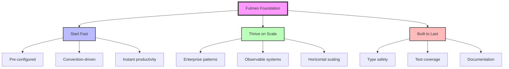

# Fulmen Technical Manifesto & Architecture Guide

## Start Fast. Thrive on Scale.

<div align="center">
  
  ⚡ **Lightning-Fast Development, Enterprise-Scale Architecture** ⚡
  
  *A technical philosophy for building systems that scale from day one*
  
</div>

---

## Table of Contents

1. [The Fulmen Philosophy](#the-fulmen-philosophy)
2. [Core Technical Principles](#core-technical-principles)
3. [Architecture Patterns](#architecture-patterns)
4. [Cross-Stack Standards](#cross-stack-standards)
5. [Language & Stack Adaptation](#language--stack-adaptation)
6. [Human-AI Collaboration](#human-ai-collaboration)
7. [Evolution & Migration](#evolution--migration)

## The Fulmen Philosophy

### Lightning Strikes with Purpose

Fulmens embody a paradox: the ability to **start fast** while being **built to scale**. This isn't about choosing between rapid prototyping and enterprise architecture—it's about having both from day one.

**The fundamental insight**: When you clone a Fulmen repository, you don't get a toy template—you get a fully operational, enterprise-ready application that can handle production workloads from the moment you launch it.

### The Four-Step Revolution: Clone → Degit → Refit → Launch

This is how Fulmens transform development:

1. **Clone**: Get the complete, working system (not just a skeleton)
2. **Degit**: Strip away template history, make it yours
3. **Refit**: Configure for your specific domain and requirements
4. **Launch**: Deploy to production with confidence

**Why this matters**: Other templates give you starting points. Fulmens give you finishing points that you customize backwards. You're not building up from nothing—you're refining something that already works at scale.

Every Fulmen template is designed with these truths:

1. **Speed without shortcuts**: Fast development doesn't mean technical debt
2. **Scale from the start**: Enterprise patterns baked in, not bolted on
3. **Production from day one**: Not a starter—a complete, working system
4. **Productivity through structure**: Conventions that accelerate, not constrain
5. **Observable by design**: You can't scale what you can't measure

### The Three Pillars



## Beyond Templates: The Fulmen Difference

### Traditional Templates vs. Fulmen Systems

**Traditional approach** (start from skeleton):

```
Empty template → Add auth → Add database → Add API → Add monitoring → Add tests → Maybe production ready?
```

_Months of work before you have something deployable_

**Fulmen approach** (start from production):

```
Working system → Customize branding → Configure domains → Deploy
```

_~~Months~~ Days to weeks to production deployment_

### What You Get in Every Fulmen

When you clone a Fulmen, you receive:

- **Complete authentication system** (not auth stubs)
- **Production monitoring** (metrics, logging, health checks)
- **Comprehensive test suite** (unit, integration, E2E)
- **CI/CD pipelines** (automated testing and deployment)
- **Security hardening** (OWASP compliance, security headers)
- **Performance optimization** (caching, compression, CDN-ready)
- **Documentation** (API docs, deployment guides, troubleshooting)
- **Scalability patterns** (horizontal scaling, load balancing)

### The Refit Philosophy

"Refit" means adapting enterprise-grade systems to your specific needs:

- **Domain customization**: Change the business logic, keep the infrastructure
- **Brand integration**: Your colors, your logos, your messaging
- **Feature selection**: Enable/disable capabilities as needed
- **Integration points**: Connect to your existing systems
- **Compliance adjustments**: Meet your regulatory requirements

**The key insight**: It's faster to remove features you don't need than to build features you do need.

## Core Fulmen Principles

Fulmen templates are built on these foundational principles, ensuring rapid development, enterprise scalability, and uncompromising quality. Each principle drives actionable practices, illustrated with examples to guide implementation across languages and toolchains.

### 1. Start Fast, Thrive on Scale

**Principle**: Launch quickly with systems built to scale massively.  
Fulmen templates are complete, production-ready applications, not empty starters. They include pre-configured authentication, observability, and horizontal scaling capabilities, enabling developers to customize and deploy in days, not months.

**Example (TypeScript)**: A Fulmen template like `fulmen-portal-forge` provides a pre-built React frontend with a scalable backend, ready for immediate deployment.

```typescript
// src/main.ts
import { createApp } from "@lib/framework";
import { authMiddleware } from "@lib/auth";
import { metrics } from "@lib/observability";

const app = createApp()
  .use(authMiddleware()) // Pre-configured OIDC auth
  .use(metrics()) // Built-in telemetry
  .get("/api/health", () => ({ status: "ok" }));

app.listen(3000); // Scalable, load-balanced server
```

This example shows a minimal setup that's ready to handle production traffic out of the box.

### 2. Be Persnickety About Code

**Principle**: Enforce zero-tolerance for code quality or test defects at every checkpoint.  
Code must pass rigorous linting, formatting, type-checking, and testing before commits. This prevents defects, especially with the high velocity of AI-assisted coding.

**Example (TypeScript)**: A `check-file` script ensures code quality for each file, integrated with pre-commit hooks.

```typescript
// scripts/check-file.ts
import { execSync } from "node:child_process";
import path from "node:path";

function checkFile(filePath: string, fix: boolean = false): boolean {
  try {
    // Type-checking
    execSync(`bunx tsc ${filePath} --noEmit`, { stdio: "inherit" });
    // Linting and formatting with Biome
    execSync(`bunx @biomejs/biome ${fix ? "format --write" : "check"} ${filePath}`, {
      stdio: "inherit",
    });
    // Run related tests
    execSync(`bun test ${path.dirname(filePath)}`, { stdio: "inherit" });
    return true;
  } catch (error) {
    console.error("Code quality check failed:", error.message);
    return false;
  }
}

// Usage: bun run check:file src/lib/utils.ts
```

**Pre-commit Hook (Husky)**:

```bash
# .husky/pre-commit
bunx lint-staged
```

```json
// package.json
{
  "lint-staged": {
    "*.{ts,tsx}": ["bun run check:file"]
  }
}
```

This ensures no defective code is committed, maintaining a pristine codebase.

### 3. Be Ruthless About Type Safety

**Principle**: Use and enforce the strongest type system available in your language, everywhere.  
Strong typing catches errors at compile-time, boosting reliability and maintainability.

**Example (TypeScript)**:

```typescript
interface Order {
  id: string;
  total: number;
  items: { sku: string; quantity: number }[];
}

function calculateTotal(order: Order): number {
  return order.items.reduce((sum, item) => sum + item.quantity * item.sku.length, 0);
}

// ❌ DON'T: Use any
function badCalculate(data: any): number {
  return data.items.reduce((sum: number, item: any) => sum + item.quantity, 0); // Risky
}
```

**Cross-Language**:

- **Python (Pydantic)**:

```python
from pydantic import BaseModel

class Order(BaseModel):
    id: str
    total: float
    items: list[dict[str, int]]

def calculate_total(order: Order) -> float:
    return sum(item['quantity'] for item in order.items)
```

- **C# (Nullable Types)**:

```csharp
public record Order(string Id, decimal Total, List<Item> Items);
public record Item(string Sku, int Quantity);

public decimal CalculateTotal(Order order)
{
    return order.Items.Sum(item => item.Quantity * item.Sku.Length);
}
```

These examples enforce type safety across languages, preventing runtime errors.

### 4. Support Observability from Day One

**Principle**: Embed metrics, logs, and tracing from the start.  
Measurable systems are scalable systems, with structured telemetry built in.

**Example (TypeScript)**:

```typescript
import { logger, metrics } from "@lib/observability";

async function processOrder(order: Order): Promise<void> {
  const timer = metrics.startTimer("order.processing.duration");
  const span = tracer.startSpan("processOrder");

  try {
    logger.info("Processing order", { orderId: order.id, total: order.total });
    // Process order logic
    metrics.increment("orders.processed", { status: "success" });
  } catch (error) {
    logger.error("Order processing failed", { orderId: order.id, error: error.message });
    metrics.increment("orders.processed", { status: "failure" });
    span.recordException(error);
    throw error;
  } finally {
    timer.end();
    span.end();
  }
}
```

This code logs structured data, tracks metrics, and supports distributed tracing, making the system observable.

**Browser-Safe Implementation**: For web applications, observability must work across all contexts without causing import failures. See the [Browser-Safe Logging Annex](./annexes/fulmen-ecosystem-browser-logging.md) for implementation patterns that prevent "process is not defined" errors while maintaining full observability.

### 5. Develop Schemas First

**Principle**: Use schemas as the single source of truth, adaptable across languages and toolchains.  
Define data contracts before coding to ensure consistency and interoperability.

**Example (TypeScript with Zod)**:

```typescript
import { z } from "zod";

const OrderSchema = z.object({
  id: z.string().uuid(),
  total: z.number().positive(),
  items: z.array(z.object({ sku: z.string(), quantity: z.number().int().positive() })),
});

type Order = z.infer<typeof OrderSchema>;

function validateOrder(data: unknown): Order {
  return OrderSchema.parse(data); // Throws on invalid data
}
```

**JSON Schema (Language-Agnostic)**:

```json
{
  "$schema": "http://json-schema.org/draft-07/schema#",
  "type": "object",
  "properties": {
    "id": { "type": "string", "format": "uuid" },
    "total": { "type": "number", "minimum": 0 },
    "items": {
      "type": "array",
      "items": {
        "type": "object",
        "properties": {
          "sku": { "type": "string" },
          "quantity": { "type": "integer", "minimum": 1 }
        },
        "required": ["sku", "quantity"]
      }
    }
  },
  "required": ["id", "total", "items"]
}
```

These schemas ensure consistent data validation across systems.

### 6. Build in AAA and Zero-Trust

**Principle**: Enable secure, enterprise-scale authentication, authorization, and audit with zero-trust architectures.  
Implement robust AAA (Authentication, Authorization, Accounting) from the start.

**Example (TypeScript)**:

```typescript
import { STSClient, AssumeRoleCommand } from "@aws-sdk/client-sts";
import { logger } from "@lib/observability";

async function getCredentials(): Promise<void> {
  const sts = new STSClient({ region: "us-east-1" });
  const command = new AssumeRoleCommand({
    RoleArn: process.env.AWS_ROLE_ARN!,
    RoleSessionName: `fulmen-${Date.now()}`,
  });

  try {
    const credentials = await sts.send(command);
    logger.info("Credentials obtained", {
      session: credentials.AssumeRoleResult?.Credentials?.SessionToken,
    });
    // Use credentials
  } catch (error) {
    logger.error("Failed to obtain credentials", { error: error.message });
    throw error;
  }
}
```

**Zero-Trust Middleware**:

```typescript
import { verifyToken } from "@lib/auth";

function authMiddleware() {
  return async (req: Request, res: Response, next: NextFunction) => {
    const token = req.headers.authorization?.split(" ")[1];
    if (!token) {
      return res.status(401).json({ error: "No token provided" });
    }

    try {
      const user = await verifyToken(token, { issuer: process.env.OIDC_ISSUER });
      req.user = user; // Attach verified user
      logger.info("User authenticated", { userId: user.id });
      next();
    } catch (error) {
      logger.warn("Authentication failed", { error: error.message });
      res.status(401).json({ error: "Invalid token" });
    }
  };
}
```

This implements secure authentication and audit logging, adhering to zero-trust principles.

### 7. Follow DRY with Purpose

**Principle**: Reuse code thoughtfully when patterns emerge naturally.  
Avoid premature abstraction, applying the Rule of Three for reuse.

**Example (TypeScript)**:

```typescript
class OrderService {
  private async handleOperation<T>(operation: () => Promise<T>): Promise<T> {
    try {
      const result = await operation();
      logger.info("Operation succeeded");
      return result;
    } catch (error) {
      logger.error("Operation failed", { error: error.message });
      throw error;
    }
  }

  async createOrder(data: Order): Promise<Order> {
    return this.handleOperation(() => this.repository.create(data));
  }

  async updateOrder(id: string, data: Partial<Order>): Promise<Order> {
    return this.handleOperation(() => this.repository.update(id, data));
  }
}
```

This extracts a common error-handling pattern only after it's used multiple times, keeping code DRY without overcomplicating.

### 8. Embrace Simplicity

**Principle**: Choose the simplest solution that works, avoiding overengineering or cleverness.  
Prioritize clear, maintainable code over complex designs, ensuring systems remain approachable and scalable.

**Example (TypeScript)**:

```typescript
// ❌ DON'T: Overengineered solution
class ComplexCalculator {
  private strategyFactory: Map<string, CalculationStrategy>;
  constructor() {
    this.strategyFactory = new Map([
      ["sum", new SumStrategy()],
      ["multiply", new MultiplyStrategy()],
    ]);
  }
  async calculate(type: string, numbers: number[]): Promise<number> {
    const strategy = this.strategyFactory.get(type);
    if (!strategy) throw new Error("Invalid strategy");
    return strategy.execute(numbers);
  }
}

// ✅ DO: Simple solution
function calculateSum(numbers: number[]): number {
  return numbers.reduce((sum, num) => sum + num, 0);
}

// Usage
const result = calculateSum([1, 2, 3]); // Simple and clear
```

This example avoids unnecessary abstractions, delivering a straightforward function that's easy to understand and maintain.

## Architecture Patterns

### 1. Horizontal Scaling by Design

Every Fulmen assumes distributed deployment:

```typescript
// Stateless service design
class OrderProcessor {
  constructor(
    private queue: MessageQueue,
    private storage: ObjectStorage,
    private cache: DistributedCache,
  ) {}

  async processOrder(orderId: string): Promise<void> {
    // No local state - everything external
    const order =
      (await this.cache.get(`order:${orderId}`)) ?? (await this.storage.get(`orders/${orderId}`));

    // Process idempotently
    if (order.status !== "pending") {
      logger.info("Order already processed", { orderId });
      return;
    }

    // Update through distributed systems
    await this.queue.publish("order.processed", {
      orderId,
      timestamp: new Date(),
    });
  }
}
```

### 2. Event-Driven Architecture

```typescript
// Event-driven patterns built in
interface DomainEvent {
  id: string;
  type: string;
  timestamp: Date;
  metadata: EventMetadata;
  payload: unknown;
}

class EventBus {
  async publish<T extends DomainEvent>(event: T): Promise<void> {
    // Validate event schema
    await this.validateEvent(event);

    // Add telemetry
    metrics.increment(`events.published.${event.type}`);

    // Publish with retry logic
    await this.withRetry(() => this.transport.publish(event));
  }
}
```

### 3. Configuration as Code

```typescript
// Type-safe configuration management
interface AppConfig {
  server: {
    port: number;
    host: string;
  };
  database: {
    url: string;
    poolSize: number;
  };
  features: {
    enableNewDashboard: boolean;
    maxUploadSize: number;
  };
}

// Single source of truth
const configSchema = z.object({
  server: z.object({
    port: z.number().min(1).max(65535),
    host: z.string(),
  }),
  // ... rest of schema
});

// Load and validate
function loadConfig(): AppConfig {
  const raw = {
    // Load from environment, files, etc.
  };

  return configSchema.parse(raw);
}
```

## Cross-Stack Standards

### Directory Structure

All Fulmens follow a predictable structure:

```
fulmen-{name}/
├── src/                    # Source code
│   ├── core/              # Business logic
│   │   ├── order.service.ts
│   │   └── order.service.test.ts  # Co-located unit test
│   ├── adapters/          # External integrations
│   ├── ports/             # Interface definitions
│   ├── shared/            # Cross-cutting concerns
│   └── assets/            # Processed assets (web projects)
│       ├── images/        # Images imported by components
│       ├── icons/         # SVG icons, icon components
│       └── fonts/         # Custom fonts
├── public/                # Static assets (web projects)
│   ├── branding/         # Logo, favicon, og-images
│   ├── mockData/         # Static JSON for development
│   └── robots.txt        # SEO/crawler files
├── tests/                 # Cross-cutting & E2E tests
│   ├── integration/       # Multi-component tests
│   └── e2e/              # Full system tests
├── fixtures/              # Test fixtures with manifests
│   ├── users/            # Domain-specific fixtures
│   │   ├── valid-user.json
│   │   └── manifest.yaml  # Checksums with comments
│   └── orders/
│       ├── test-order.json
│       └── manifest.yaml
├── schemas/               # API & data schemas
│   ├── openapi/          # OpenAPI specifications
│   ├── graphql/          # GraphQL schemas
│   └── json-schema/      # JSON Schema definitions
├── .plans/                # Development planning (optional)
│   ├── active/           # Current work in progress
│   └── archive/          # Completed or abandoned plans
├── docs/                  # Documentation
│   ├── architecture/      # ADRs and design docs
│   ├── api/              # API documentation
│   ├── fulmen/           # Fulmen-specific guides
│   └── substaile/        # Standards and prompts
├── scripts/              # Automation scripts (Bun TypeScript)
└── config/               # Configuration files
```

### Asset Organization Patterns

Fulmens use a structured approach to asset management based on asset type and usage:

#### 1. Web Frontend Assets

**Processed Assets** (`src/assets/`)

- Images imported by components
- Icons used in the UI
- Custom fonts
- Assets that need optimization, hashing, or bundling

```typescript
// Component using processed asset
import logo from '@/assets/images/logo.svg';
import { ReactComponent as MenuIcon } from '@/assets/icons/menu.svg';

function Header() {
  return (
    <header>
      
      <MenuIcon className="w-6 h-6" />
    </header>
  );
}
```

**Static Assets** (`public/`)

- Files served directly without processing
- Assets that must maintain exact paths
- SEO files (robots.txt, sitemap.xml)
- Favicons and social media images

```html
<!-- index.html -->
<link rel="icon" href="/branding/favicon.ico" />
<meta property="og:image" content="/branding/og-image.png" />
```

#### 2. Schemas and Contracts

**Code-Based Schemas** (`src/types/` or `src/schemas/`)

- TypeScript interfaces and types
- Zod schemas for runtime validation
- Domain models

```typescript
// src/schemas/user.schema.ts
import { z } from "zod";

export const UserSchema = z.object({
  id: z.string().uuid(),
  email: z.string().email(),
  name: z.string().min(1).max(100),
});

export type User = z.infer<typeof UserSchema>;
```

**API Schemas** (`schemas/`)

- OpenAPI/Swagger specifications
- GraphQL schema definitions
- JSON Schema files
- Language-agnostic contracts

```yaml
# schemas/openapi/users-api.yaml
openapi: 3.0.0
info:
  title: Users API
  version: 1.0.0
paths:
  /users:
    get:
      summary: List users
      # ...
```

#### 3. Non-Web Projects

For CLI tools, services, and other non-web Fulmens:

```
fulmen-runner-forge/
├── src/
├── tests/
├── fixtures/
├── schemas/              # API contracts if needed
├── templates/            # File templates for code generation
│   ├── config/          # Configuration templates
│   └── code/            # Code generation templates
├── resources/            # Runtime resources
│   ├── migrations/      # Database migrations
│   └── seeds/           # Seed data
└── docs/
```

### Asset Management Best Practices

1. **Clear Purpose Separation**
   - `src/assets/`: Build-time processed assets
   - `public/`: Runtime static assets
   - `schemas/`: Contract definitions
   - `fixtures/`: Test data
   - `templates/`: Generation templates

2. **Avoid Generic Folders**

   ```
   ❌ DON'T: Create catch-all directories
   /assets/
     everything-mixed-together/

   ✅ DO: Use purpose-specific organization
   /src/assets/      # Processed by build
   /public/          # Static files
   /schemas/         # API contracts
   ```

3. **Framework Alignment**
   - Follow framework conventions (Vite, Next.js, etc.)
   - Use build tool capabilities for optimization
   - Maintain clear import paths

4. **Documentation**
   - Document asset sources and licenses
   - Include README in asset directories
   - Track binary files appropriately in Git

### Testing Standards

Every Fulmen includes comprehensive testing, with flexibility in test organization:

1. **Unit Tests**: 80%+ coverage for business logic
2. **Integration Tests**: Key flow validation
3. **Contract Tests**: API boundary verification
4. **Performance Tests**: Baseline metrics
5. **Test Fixtures**: Curated test data with integrity validation

#### Test Organization Patterns

Fulmens support two testing patterns, choose based on your project needs:

**Pattern 1: Co-located Tests** (Recommended for UI-heavy projects)

```
src/
├── components/
│   ├── Button/
│   │   ├── Button.tsx
│   │   ├── Button.test.tsx      # Unit test
│   │   └── Button.stories.tsx   # Visual tests (Storybook)
│   └── Form/
│       ├── Form.tsx
│       └── Form.test.tsx
├── services/
│   ├── auth.service.ts
│   └── auth.service.test.ts
└── tests/                       # Only E2E/integration
    └── e2e/
        └── user-flow.test.ts
```

**Pattern 2: Separate Test Directory** (Traditional approach)

```
src/                             # Pure source code
├── components/
├── services/
└── utils/
tests/                           # All tests separate
├── unit/
│   ├── components/
│   └── services/
├── integration/
└── e2e/
```

**Test Types and Scope**:

1. **Unit Tests** (`.test.ts`, `.test.tsx`)
   - Test individual functions, components, or classes in isolation
   - Mock all external dependencies
   - Should run in milliseconds
   - Example: Testing a calculation function or React component render

2. **Integration Tests** (`tests/integration/`)
   - Test multiple components working together
   - Use real implementations where possible
   - Mock only external systems (databases, APIs)
   - Example: Testing service layer with repository layer

3. **End-to-End Tests** (`tests/e2e/`)
   - Test complete user workflows
   - Run against a real or near-real environment
   - Minimal mocking
   - Example: User login → browse → purchase → logout flow

4. **Visual Tests** (`.stories.tsx` - Storybook)
   - Document component variations and states
   - Enable visual regression testing
   - Serve as living documentation
   - Example: Button component in all states (default, hover, disabled, loading)

**Guidance**:

- **Co-locate** when using Vite/Vitest, React, or similar frameworks
- **Separate** when team prefers clear src/test boundaries
- **Always separate** E2E tests as they span the entire system
- Be consistent within a project

```typescript
// Example test structure (co-located)
// src/services/order.service.test.ts
describe("OrderService", () => {
  // Unit tests right next to implementation
  describe("calculateTotal", () => {
    it("should sum item prices", () => {
      const items = [
        { price: 10, quantity: 2 },
        { price: 15, quantity: 1 },
      ];
      expect(calculateTotal(items)).toBe(35);
    });
  });
});

// tests/e2e/checkout.test.ts
describe("Checkout Flow", () => {
  // E2E tests in separate directory
  it("should complete purchase from cart to confirmation", async () => {
    // Full user journey test
  });
});
```

### Test Fixtures

Fulmens include curated test fixtures with manifest validation:

```yaml
# fixtures/users/manifest.yaml
directory_info:
  description: User test fixtures for authentication and authorization tests
  purpose: Testing
  created: "2025-01-15T10:00:00.000000"
  last_updated: "2025-01-20T14:30:00.000000"
  version: 1.0.0
documents:
  - filename: valid-user.json
    description: "Test fixture: Standard user with basic permissions"
    hash:
      algorithm: sha256
      value: a665a45920422f9d417e4867efdc4fb8a04a1f3fff1fa07e998e86f7f7a27ae3
    size: 234
    format: json
    expected_results:
      can_login: true
      can_edit_profile: true
      can_admin: false
    tags: ["auth", "user", "valid"]
    source: Internal creation for test purposes
    author: Fulmen Team
    license: MIT
    created: "2025-01-15T10:00:00.000000"
    last_modified: "2025-01-15T10:00:00.000000"
    file_extension: .json
    has_expectations: true
  - filename: admin-user.json
    description: "Test fixture: Admin user with elevated permissions"
    hash:
      algorithm: sha256
      value: b3a8e0e1f9ab1bfe3a36f231f676f78bb30a519d2b21e6c530c0eee8ebb4a5d0
    size: 267
    format: json
    expected_results:
      can_login: true
      can_edit_profile: true
      can_admin: true
    tags: ["auth", "user", "admin", "valid"]
    source: Internal creation for test purposes
    author: Fulmen Team
    license: MIT
    created: "2025-01-15T10:00:00.000000"
    last_modified: "2025-01-18T09:00:00.000000"
    file_extension: .json
    has_expectations: true
```

**Fixture Manifest Schema**:

```typescript
// schemas/fixture-manifest.schema.ts
import { z } from "zod";

export const FixtureManifestSchema = z.object({
  directory_info: z.object({
    description: z.string(),
    purpose: z.string(),
    created: z.string().datetime(),
    last_updated: z.string().datetime(),
    version: z.string(),
  }),
  documents: z.array(
    z.object({
      filename: z.string(),
      description: z.string(),
      hash: z.object({
        algorithm: z.enum(["sha256", "sha512", "md5"]),
        value: z.string(),
      }),
      size: z.number().positive(),
      format: z.string(),
      expected_results: z.record(z.unknown()).optional(),
      tags: z.array(z.string()),
      source: z.string(),
      author: z.string(),
      license: z.string(),
      created: z.string().datetime(),
      last_modified: z.string().datetime(),
      file_extension: z.string(),
      has_expectations: z.boolean(),
    }),
  ),
});

// Type inference
export type FixtureManifest = z.infer<typeof FixtureManifestSchema>;
```

**Fixture Validation Usage**:

```typescript
// test-utils/fixture-loader.ts
import { readFile } from "node:fs/promises";
import { parse } from "yaml";
import { createHash } from "node:crypto";
import { FixtureManifestSchema } from "@/schemas/fixture-manifest.schema";

export async function loadFixture(path: string): Promise<unknown> {
  const [category, filename] = path.split("/");
  const manifestPath = `fixtures/${category}/manifest.yaml`;

  // Load and validate manifest
  const manifestContent = await readFile(manifestPath, "utf-8");
  const manifest = FixtureManifestSchema.parse(parse(manifestContent));

  // Find file entry
  const fileEntry = manifest.documents.find(doc => doc.filename === filename);
  if (!fileEntry) {
    throw new Error(`Fixture ${filename} not found in manifest`);
  }

  // Load fixture and verify checksum
  const fixturePath = `fixtures/${path}`;
  const fixtureContent = await readFile(fixturePath);
  const hash = createHash(fileEntry.hash.algorithm).update(fixtureContent).digest("hex");

  if (hash !== fileEntry.hash.value) {
    throw new Error(
      `Fixture ${filename} has been modified. ` +
        `Expected hash: ${fileEntry.hash.value}, got: ${hash}`,
    );
  }

  // Parse based on format
  switch (fileEntry.format) {
    case "json":
      return JSON.parse(fixtureContent.toString());
    case "yaml":
      return parse(fixtureContent.toString());
    default:
      return fixtureContent.toString();
  }
}
```

### Scripts and Automation

**Principle**: Type-safe, cross-platform automation.

Fulmens are opinionated about scripting:

1. **Bun TypeScript by default**: Type safety for automation
2. **No bash scripts**: Windows compatibility required
3. **Structured CLI tools**: Use Commander.js for complex interfaces
4. **Platform neutrality**: Must run on Windows, macOS, and Linux

```typescript
// scripts/setup.ts - Type-safe setup script
import { Command } from "commander";
import { z } from "zod";
import { logger } from "../src/lib/logger";

const SetupOptionsSchema = z.object({
  environment: z.enum(["development", "staging", "production"]),
  skipDatabase: z.boolean().optional(),
  verbose: z.boolean().optional(),
});

type SetupOptions = z.infer<typeof SetupOptionsSchema>;

const program = new Command()
  .name("setup")
  .description("Set up the Fulmen project")
  .option("-e, --environment <env>", "Target environment", "development")
  .option("--skip-database", "Skip database setup")
  .option("-v, --verbose", "Verbose output")
  .action(async options => {
    try {
      const validatedOptions = SetupOptionsSchema.parse(options);
      await runSetup(validatedOptions);
    } catch (error) {
      if (error instanceof z.ZodError) {
        logger.error("Invalid options", { errors: error.errors });
        process.exit(1);
      }
      throw error;
    }
  });

async function runSetup(options: SetupOptions): Promise<void> {
  logger.info("Starting setup", { environment: options.environment });

  // Platform-neutral operations only
  // No shell-specific commands
  // Use Node.js APIs or cross-platform packages
}

program.parse();
```

**Script Standards**:

```typescript
// ❌ DON'T: Use bash/shell scripts
#!/bin/bash
rm -rf dist/
mkdir -p dist/
cp -r src/* dist/

// ✅ DO: Use TypeScript with cross-platform libraries
import { rm, mkdir, cp } from 'node:fs/promises';
import { join } from 'node:path';

async function clean() {
  await rm('dist', { recursive: true, force: true });
  await mkdir('dist', { recursive: true });
  await cp('src', 'dist', { recursive: true });
}
```

## Language & Stack Adaptation

### TypeScript/JavaScript (Bun/Node)

```typescript
// Leverage TypeScript's type system fully
type Result<T, E = Error> = { success: true; data: T } | { success: false; error: E };

// Use modern async patterns
const processItems = async (items: Item[]): Promise<Result<ProcessedItem[]>> => {
  try {
    const results = await Promise.all(items.map(item => processItem(item)));
    return { success: true, data: results };
  } catch (error) {
    return { success: false, error: error as Error };
  }
};
```

### Python

```python
# Type hints are mandatory
from typing import List, Optional, Dict, Any
from dataclasses import dataclass
from datetime import datetime

@dataclass
class Order:
    id: str
    items: List[OrderItem]
    created_at: datetime
    metadata: Optional[Dict[str, Any]] = None

async def process_order(order: Order) -> OrderResult:
    """Process an order with full type safety."""
    # Implementation
```

### C#/.NET

```csharp
// Nullable reference types enabled
#nullable enable

public record Order(
    string Id,
    IReadOnlyList<OrderItem> Items,
    DateTime CreatedAt,
    IReadOnlyDictionary<string, object>? Metadata = null
);

public async Task<Result<ProcessedOrder>> ProcessOrderAsync(
    Order order,
    CancellationToken cancellationToken = default)
{
    // Pattern matching and modern C# features
    return order switch
    {
        { Items.Count: 0 } => Result<ProcessedOrder>.Failure("Empty order"),
        _ => await ProcessValidOrderAsync(order, cancellationToken)
    };
}
```

## Human-AI Collaboration

### Substaile Integration

Fulmens are designed for effective human-AI collaboration:

1. **Clear Context Boundaries**: Well-defined modules with explicit interfaces
2. **Self-Documenting Code**: Types and names that explain intent
3. **AI-Friendly Patterns**: Consistent structures that AI can recognize
4. **Explicit Constraints**: Validation and types that prevent invalid states

**Collaboration in Practice**:

```typescript
/**
 * Order Processing Service
 *
 * Human: Defines business rules and edge cases
 * AI: Assists with boilerplate, test generation, and pattern implementation
 *
 * Business Rules (Human-Defined):
 * - Orders over $1000 require manager approval
 * - Rush orders incur 20% surcharge
 * - Inventory must be reserved before payment
 *
 * Implementation Pattern (AI-Assistable):
 * - Validate → Reserve → Process → Notify
 */
class OrderService {
  async processOrder(request: OrderRequest): Promise<OrderResult> {
    // AI can generate validation boilerplate from schema
    const validation = await this.validateOrder(request);
    if (!validation.isValid) {
      return OrderResult.invalid(validation.errors);
    }

    // Human defines business logic, AI helps with error handling patterns
    if (request.total > 1000 && !request.managerApproval) {
      // AI: Suggested adding audit log here based on pattern
      logger.warn("Order requires approval", {
        orderId: request.id,
        amount: request.total,
      });
      return OrderResult.requiresApproval();
    }

    // AI can generate try-catch patterns and telemetry
    const span = tracer.startSpan("processOrder");
    try {
      // Human: Core business logic sequence
      const inventory = await this.reserveInventory(request.items);
      const payment = await this.processPayment(request.payment);
      const confirmation = await this.createConfirmation(inventory, payment);

      // AI: Generated notification dispatch from pattern
      await this.notificationService.dispatch({
        type: "order.confirmed",
        recipient: request.customer.email,
        data: confirmation,
      });

      return OrderResult.success(confirmation);
    } catch (error) {
      // AI: Standard error handling pattern
      span.recordException(error as Error);
      logger.error("Order processing failed", {
        orderId: request.id,
        stage: this.determineFailureStage(error),
        error,
      });
      throw error;
    } finally {
      span.end();
    }
  }

  // AI can generate test cases from the schema and business rules
  // Human reviews and adds edge cases
}
```

**Practical Collaboration Examples**:

1. **Schema → Code Generation**:
   - Human defines the data model and constraints
   - AI generates validation functions, TypeScript types, and basic CRUD operations
   - Human reviews and adds business logic

2. **Test Generation**:
   - AI generates test cases from schemas and type definitions
   - Human adds business-specific test scenarios
   - AI assists with test data generation and mocking patterns

3. **Documentation**:
   - AI extracts patterns and generates initial documentation
   - Human adds context, decisions, and rationale
   - AI maintains consistency across documentation

4. **Refactoring**:
   - Human identifies what needs refactoring and why
   - AI applies consistent patterns across the codebase
   - Human reviews for business logic correctness

## Evolution & Migration

### Development Planning

**Principle**: Make thinking visible, track decisions, enable collaboration.

Fulmens include an optional `.plans/` directory for development planning:

```
.plans/
├── active/                 # Work in progress
│   ├── 20250123-claude-auth-refactor/
│   │   ├── README.md      # Overview and status
│   │   ├── design.md      # Technical approach
│   │   ├── tasks.md       # Breakdown and progress
│   │   └── snippets/      # Code explorations
│   └── 20250125-dave-performance-optimization/
└── archive/               # Completed or abandoned
    └── 20250115-alex-payment-integration/
```

**Naming Convention**: `YYYYMMDD-<developer>-<descriptive-name>`

- Date for natural sorting and timeline tracking
- Developer identifier (human name or AI assistant)
- Descriptive project/task name using kebab-case

**Plan Structure** (suggested):

```markdown
# README.md in each plan folder

## Auth System Refactor

**Developer**: claude (AI) / Dave (Human reviewer)  
**Started**: 2025-01-23  
**Status**: In Progress  
**Branch**: feature/auth-refactor

### Overview

Refactoring authentication to support OIDC...

### Goals

- [ ] Remove hardcoded auth logic
- [ ] Implement OIDC provider
- [ ] Add comprehensive tests

### Decision Log

- 2025-01-23: Chose OIDC over SAML for simplicity
- 2025-01-24: Decided to keep backward compatibility
```

**Git Strategy**:

```gitignore
# Option 1: Commit plans for team visibility
# (no entry in .gitignore)

# Option 2: Keep plans local
.plans/

# Option 3: Hybrid - commit archives only
.plans/active/
```

**Benefits**:

- Track reasoning behind changes
- Enable async collaboration
- Document abandoned approaches
- Build organizational knowledge
- Support AI-assisted development by preserving context

### Growing Beyond Your Fulmen

Fulmens are starting points, not straightjackets. When your project grows:

1. **Gradual Migration**: Move components to specialized services
2. **Maintain Patterns**: Keep the same architectural principles
3. **Extract Libraries**: Turn common code into shared packages
4. **Document Divergence**: Track where you've moved beyond the template

```typescript
// Example: Extracting a service
// Before: Monolithic Fulmen
class PortalApp {
  async handleUserRequest(request: Request) {
    // Auth, processing, response all in one place
  }
}

// After: Service extraction
class AuthService {
  async authenticate(token: string): Promise<User> {
    // Extracted authentication logic
  }
}

class PortalApp {
  constructor(private auth: AuthService) {}

  async handleUserRequest(request: Request) {
    const user = await this.auth.authenticate(request.token);
    // Focused on portal-specific logic
  }
}
```

### Version Evolution

```yaml
# Track your divergence from the original Fulmen
fulmen:
  source: "fulmen-portal-forge"
  version: "1.0.0"
  divergence:
    - "Extracted auth to separate service"
    - "Added custom caching layer"
    - "Replaced default ORM with custom solution"
  compatibility: "partial" # full, partial, none
```

## Conclusion

Fulmens represent a philosophy: that we can have both speed and scale, that conventions can liberate rather than constrain, and that the best time to build for scale is at the beginning.

Every line of code in a Fulmen template is there for a reason. Every pattern has been battle-tested. Every convention enables both rapid development today and sustainable growth tomorrow.

**Start Fast. Thrive on Scale.** It's not just a tagline—it's an architectural commitment.

---

<div align="center">
  
  ⚡ **Build with confidence. Scale with certainty.** ⚡
  
  *Part of the 3 Leaps Fulmen Ecosystem*
  
</div>
