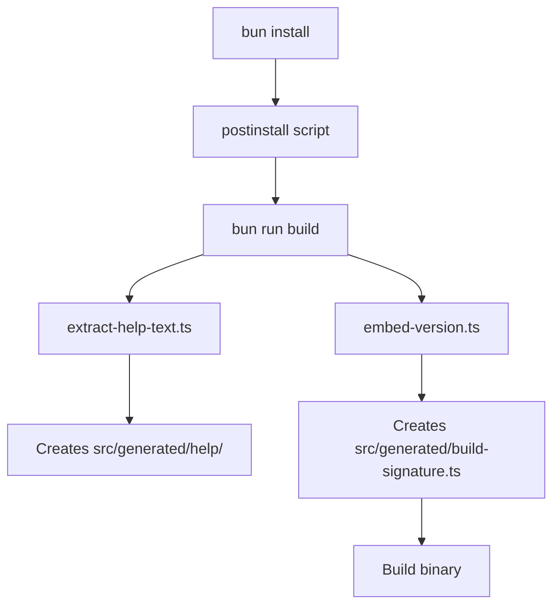

# Multi-Platform Build Support

This document outlines Brooklyn MCP's approach to ensuring reliable cross-platform builds across Windows, macOS, and Linux environments.

## Overview

Brooklyn MCP supports building and running on multiple platforms through careful handling of platform-specific differences in file system operations, directory structures, and build processes.

## Platform Support Matrix

| Platform | Architecture | Status       | CI/CD          | Notes                          |
| -------- | ------------ | ------------ | -------------- | ------------------------------ |
| Windows  | x64, ARM64   | ✅ Supported | GitHub Actions | Requires special path handling |
| macOS    | x64, ARM64   | ✅ Supported | GitHub Actions | Primary development platform   |
| Linux    | x64, ARM64   | ✅ Supported | GitHub Actions | Container-friendly             |

## Cross-Platform Build Challenges & Solutions

### 1. Directory Creation Issues

**Problem**: Windows requires explicit directory creation before writing files, while macOS/Linux are more permissive.

**Root Cause**: Windows fails with `ENOENT` errors when attempting to write to non-existent directory paths.

**Solution**: Ensure all build scripts create required directories before file operations.

```typescript
// ❌ WRONG: Direct file write without directory check
await fs.writeFile("src/generated/build-signature.ts", content);

// ✅ CORRECT: Ensure directory exists first
await fs.mkdir(path.dirname(filePath), { recursive: true });
await fs.writeFile(filePath, content);
```

**Fixed in**: `scripts/embed-version.ts` - Added directory creation for build signature generation.

### 2. Test Database Initialization

**Problem**: SQLite database initialization fails in CI environments due to missing test directory structures.

**Root Cause**: Tests attempt to create database files in `tests/test-databases/` but the directory doesn't exist in fresh CI containers.

**Solution**: Infrastructure setup script that creates all required directories before tests run.

```typescript
// Created: scripts/setup-test-infrastructure.ts
const requiredDirectories = [
  "tests/test-databases",
  "tests/fixtures/temp",
  "tests/fixtures/screenshots",
  // ... more directories
];

for (const dir of requiredDirectories) {
  const dirPath = join(process.cwd(), dir);
  if (!existsSync(dirPath)) {
    mkdirSync(dirPath, { recursive: true });
  }
}
```

**Fixed in**: Added `setup:test-infra` command and integrated into CI workflows.

### 3. Path Separator Handling

**Problem**: Mixed usage of `/` and `\` path separators can cause issues across platforms.

**Solution**: Always use Node.js `path` module for cross-platform path operations.

```typescript
// ❌ WRONG: Hardcoded path separators
const filePath = "src/generated/build-signature.ts";

// ✅ CORRECT: Use path.join() for cross-platform compatibility
const filePath = path.join("src", "generated", "build-signature.ts");
```

**Fixed in**: All build scripts now use proper path handling and dynamic regex patterns for cross-platform compatibility.

### 4. Cross-Platform Temp Directory Handling

**Problem**: Hardcoded `/tmp/` paths fail on Windows, which uses different temporary directory locations.

**Root Cause**: Windows uses `%TEMP%` (typically `C:\Users\Username\AppData\Local\Temp\`) while Unix-like systems use `/tmp/`.

**Solution**: Always use Node.js `os.tmpdir()` for temporary directory operations.

```typescript
// ❌ WRONG: Hardcoded Unix temp path
const tempPath = "/tmp/brooklyn-dev";

// ✅ CORRECT: Cross-platform temp directory
import { tmpdir } from "os";
import { join } from "path";
const tempPath = join(tmpdir(), "brooklyn-dev");
```

**Fixed in**:

- `scripts/setup-dev-mode.ts` - Uses `os.tmpdir()` for cross-platform temp directory
- `src/core/mcp-dev-manager.ts` - Updated temp directory resolution
- All test infrastructure scripts now use platform-aware paths

### 5. CI/CD Environment Differences

**Problem**: Different CI environments (Ubuntu, Windows, macOS) have different default directory structures and permissions.

**Solution**: Standardized setup process that works across all CI environments.

**Enhanced CI Workflow Steps**:

1. **Platform-specific tool installation**: Install required build tools (Windows only)
2. **Tool verification**: Verify all required tools are available and working
3. Install dependencies: `bun install --frozen-lockfile`
4. Setup browsers: `bun run setup:browsers` (for browser-dependent tests)
5. **Setup test infrastructure**: `bun run setup:test-infra` ⬅ **Critical for Windows**
6. Run quality gates: `bun run check-all` (now includes `release:validate`)
7. Build all platforms: `bun run build:all`
8. Package distribution artifacts: `bun run package:all`
9. **Enhanced release upload**: Graceful handling of existing releases and missing files

**Key Improvements in CI Process:**

- **Fail-fast validation**: Tool version checks prevent build failures later in pipeline
- **Enhanced prepush validation**: Now includes full `release:validate` to catch issues locally
- **Robust artifact upload**: Uses `fail_on_unmatched_files: false` and `overwrite: true` for reliability
- **Cross-platform consistency**: All platforms now have identical tooling available

## Build Process Architecture

### 1. Generated File Management

Brooklyn generates several files during the build process:

```
src/generated/
├── build-signature.ts    # Build metadata and version info
└── help/                 # Extracted help documentation
    ├── index.ts
    ├── command-name.txt
    ├── mcp-setup.txt
    └── mcp-troubleshooting.txt
```

**Critical**: All scripts must ensure `src/generated/` directory exists before writing files.

### 2. Build Script Dependencies



### 3. Test Infrastructure Setup

Required for all platforms, critical for Windows:

```bash
# Creates test directories before test execution
bun run setup:test-infra

# Test commands that depend on infrastructure
bun run test:unit          # Unit tests
bun run test:integration   # Integration tests
bun run test:e2e          # End-to-end tests
```

## Build Prerequisites

### Required Tools by Platform

Brooklyn MCP requires specific build tools for cross-platform binary packaging:

#### Windows

```powershell
# Using Scoop (recommended)
scoop install zip unzip
scoop install coreutils  # Provides shasum

# Using Chocolatey
choco install zip unzip
choco install coreutils-sha256sum

# Using Windows Package Manager (winget)
winget install 7zip.7zip
# Note: For shasum, install Git for Windows which includes it
winget install Git.Git
```

#### macOS

```bash
# Using Homebrew (usually pre-installed)
brew install coreutils  # Provides shasum (if missing)

# Usually pre-installed: zip, tar, shasum
# Verify with: which zip tar shasum
```

#### Linux

```bash
# Ubuntu/Debian
sudo apt install zip unzip coreutils

# CentOS/RHEL/Fedora
sudo yum install zip unzip coreutils
# or
sudo dnf install zip unzip coreutils

# Alpine
apk add zip unzip coreutils

# Arch Linux
sudo pacman -S zip unzip coreutils
```

### CI/CD Environment

**GitHub Actions Platform Support:**

| Platform         | `zip`                | `tar`            | `shasum`             | Additional Setup Required       |
| ---------------- | -------------------- | ---------------- | -------------------- | ------------------------------- |
| `ubuntu-latest`  | ✅ Pre-installed     | ✅ Pre-installed | ✅ Pre-installed     | None                            |
| `macos-latest`   | ✅ Pre-installed     | ✅ Pre-installed | ✅ Pre-installed     | None                            |
| `windows-latest` | ❌ **Not available** | ✅ Pre-installed | ❌ **Not available** | **Scoop installation required** |

**Windows CI Setup (Required):**
Our GitHub Actions workflow automatically installs missing tools on Windows runners using Scoop:

```yaml
- name: Install Windows build tools
  if: runner.os == 'Windows'
  run: |
    Set-ExecutionPolicy -ExecutionPolicy RemoteSigned -Scope CurrentUser
    Invoke-RestMethod -Uri https://get.scoop.sh | Invoke-Expression
    echo "$env:USERPROFILE\scoop\shims" | Out-File -FilePath $env:GITHUB_PATH -Encoding utf8 -Append
    scoop install zip shasum
  shell: pwsh

- name: Verify Windows tools
  if: runner.os == 'Windows'
  run: |
    zip --version
    shasum --version  
    tar --version
  shell: pwsh
```

### Local Development Setup

For developers who want to run full cross-platform builds locally:

```bash
# Verify prerequisites
which zip tar shasum
# Should return paths to all three tools

# If missing on Windows, install via your preferred package manager
# If missing on macOS/Linux, install via your system's package manager
```

### Build Script Dependencies

The packaging pipeline requires these tools in `PATH`:

- **`zip`**: For creating `.zip` archives (`package-all.ts` line 92)
- **`tar`**: For creating `.tar.gz` archives (`package-all.ts` line 99)
- **`shasum`**: For generating SHA256 checksums (local packaging only)

**Note**: CI uses Node.js crypto module for checksums, not `shasum` command.

## Platform-Specific Considerations

### Windows

- **Directory creation**: Must explicitly create directories before file writes
- **Path handling**: Use `path.join()` consistently for all file operations
- **Temp directory**: Use `os.tmpdir()` instead of hardcoded `/tmp/` paths
- **SQLite**: Requires proper directory setup for database file creation
- **PowerShell vs CMD**: Scripts should work in both environments
- **Build tools**: Missing `zip` and `shasum` by default - automatically installed via Scoop in CI
- **Path separator handling**: Test assertions must use dynamic patterns (`path.sep`) instead of hardcoded `/`
- **CI environment**: Requires special setup for build tools (handled automatically in GitHub Actions)

**Recent Windows Compatibility Fixes:**

- Fixed hardcoded `/tmp/` paths to use `os.tmpdir()` in dev mode and MCP manager
- Updated test assertions to use platform-aware path separators
- Added comprehensive Scoop-based tool installation for CI builds
- Enhanced version command test to handle `.exe` extension correctly
- Improved timing tolerance for CI environment variations (5ms buffer)

### macOS

- **Primary development platform**: Most permissive file system operations
- **ARM64 (M1/M2)**: Native support with proper architecture detection
- **Permissions**: Generally more lenient than Windows

### Linux (CI/CD)

- **Container environments**: Clean slate requires full infrastructure setup
- **Ubuntu runners**: Standard GitHub Actions environment
- **Package management**: Relies on system package availability

## Testing Cross-Platform Builds

### Local Development

```bash
# Test Windows-like behavior (strict directory creation)
rm -rf src/generated tests/test-databases
bun install --frozen-lockfile

# Test infrastructure setup
bun run setup:test-infra
bun run test:e2e

# Test build process
bun run build:all
```

### CI/CD Validation

The release workflow validates across all platforms:

1. **Validate Release Readiness** (Ubuntu)
2. **Build and Release** (Windows, macOS, Linux)
3. **Post-Release Validation** (Ubuntu)

## Troubleshooting

### Common Cross-Platform Issues

**Error**: `ENOENT: no such file or directory`

- **Cause**: Attempting to write to non-existent directory
- **Fix**: Add directory creation with `{ recursive: true }`

**Error**: SQLite database initialization fails

- **Cause**: Missing `tests/test-databases/` directory
- **Fix**: Run `bun run setup:test-infra` before tests

**Error**: Path separator issues

- **Cause**: Hardcoded `/` or `\` in file paths
- **Fix**: Use `path.join()` for all path operations

**Error**: `bun: command not found: zip` (Windows CI)

- **Cause**: Windows GitHub runners don't have `zip` or `shasum` pre-installed
- **Fix**: Automatic Scoop installation in CI workflow (see Windows CI Setup above)

**Error**: Test assertions failing with path mismatches on Windows

- **Cause**: Test expectations using hardcoded Unix path separators (`/`)
- **Fix**: Use dynamic path separator patterns (`path.sep`) or platform-aware assertions

**Error**: Temp directory access failures on Windows

- **Cause**: Using hardcoded `/tmp/` paths instead of Windows temp directory
- **Fix**: Always use `os.tmpdir()` for temporary file operations

**Error**: `Pattern 'file.json' does not match any files` in GitHub release upload

- **Cause**: Missing license files or build artifacts not created properly
- **Fix**: Ensure `package:all` runs before release upload; use `fail_on_unmatched_files: false`

### Debugging Build Issues

1. **Enable verbose logging**: Set `DEBUG=brooklyn:*` environment variable
2. **Check directory structure**: Verify all required directories exist
3. **Validate paths**: Ensure all file paths use `path.join()`
4. **Test locally**: Reproduce CI environment by removing generated files

## Best Practices

### For Developers

1. **Always use `path.join()`** for file path construction
2. **Create directories before writing files** using `{ recursive: true }`
3. **Use `os.tmpdir()`** instead of hardcoded `/tmp/` paths
4. **Test assertions**: Use dynamic path separators (`path.sep`) not hardcoded `/` or `\`
5. **Test on multiple platforms** when possible, especially Windows
6. **Use cross-platform commands** in package.json scripts
7. **Handle binary extensions**: Remember `.exe` suffix on Windows for executable tests

### For CI/CD

1. **Platform-specific setup**: Install required tools before build process
2. **Tool verification**: Add fail-fast checks for required build tools
3. **Run infrastructure setup** before tests on all platforms
4. **Use consistent Node.js/Bun versions** across all runners
5. **Validate artifacts** are created correctly on each platform
6. **Graceful error handling**: Use robust upload configurations with appropriate fallbacks
7. **Enhanced prepush validation**: Include `release:validate` to catch issues before push

## Future Improvements

- [ ] **Automated cross-platform testing** in pre-commit hooks
- [ ] **Docker-based local testing** to simulate CI environments
- [ ] **Platform-specific optimization** for build performance
- [ ] **Enhanced error reporting** for platform-specific failures

## Related Documentation

- [Native Dependencies Guide](../installation/native-dependencies.md) - Platform-specific dependency installation
- [MCP Configuration](./mcp-configuration.md) - Cross-platform MCP server setup
- [Development Standards](../development/standards/coding-standards.md) - Code quality requirements

---

_This document is updated as we encounter and resolve new cross-platform build challenges._
