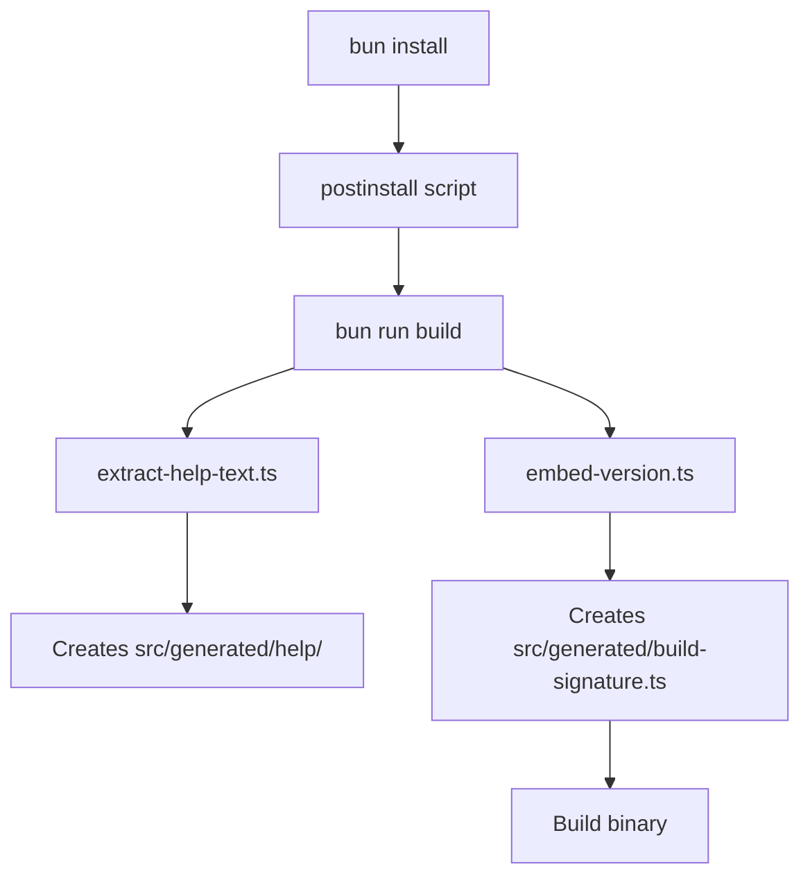

# Multi-Platform Build Support

This document outlines Brooklyn MCP's approach to ensuring reliable cross-platform builds across Windows, macOS, and Linux environments.

## Overview

Brooklyn MCP supports building and running on multiple platforms through careful handling of platform-specific differences in file system operations, directory structures, and build processes.

## Platform Support Matrix

| Platform | Architecture | Status       | CI/CD          | Notes                          |
| -------- | ------------ | ------------ | -------------- | ------------------------------ |
| Windows  | x64, ARM64   | ✅ Supported | GitHub Actions | Requires special path handling |
| macOS    | x64, ARM64   | ✅ Supported | GitHub Actions | Primary development platform   |
| Linux    | x64, ARM64   | ✅ Supported | GitHub Actions | Container-friendly             |

## Cross-Platform Build Challenges & Solutions

### 1. Directory Creation Issues

**Problem**: Windows requires explicit directory creation before writing files, while macOS/Linux are more permissive.

**Root Cause**: Windows fails with `ENOENT` errors when attempting to write to non-existent directory paths.

**Solution**: Ensure all build scripts create required directories before file operations.

```typescript
// ❌ WRONG: Direct file write without directory check
await fs.writeFile("src/generated/build-signature.ts", content);

// ✅ CORRECT: Ensure directory exists first
await fs.mkdir(path.dirname(filePath), { recursive: true });
await fs.writeFile(filePath, content);
```

**Fixed in**: `scripts/embed-version.ts` - Added directory creation for build signature generation.

### 2. Test Database Initialization

**Problem**: SQLite database initialization fails in CI environments due to missing test directory structures.

**Root Cause**: Tests attempt to create database files in `tests/test-databases/` but the directory doesn't exist in fresh CI containers.

**Solution**: Infrastructure setup script that creates all required directories before tests run.

```typescript
// Created: scripts/setup-test-infrastructure.ts
const requiredDirectories = [
  "tests/test-databases",
  "tests/fixtures/temp",
  "tests/fixtures/screenshots",
  // ... more directories
];

for (const dir of requiredDirectories) {
  const dirPath = join(process.cwd(), dir);
  if (!existsSync(dirPath)) {
    mkdirSync(dirPath, { recursive: true });
  }
}
```

**Fixed in**: Added `setup:test-infra` command and integrated into CI workflows.

### 3. Path Separator Handling

**Problem**: Mixed usage of `/` and `\` path separators can cause issues across platforms.

**Solution**: Always use Node.js `path` module for cross-platform path operations.

```typescript
// ❌ WRONG: Hardcoded path separators
const filePath = "src/generated/build-signature.ts";

// ✅ CORRECT: Use path.join() for cross-platform compatibility
const filePath = path.join("src", "generated", "build-signature.ts");
```

### 4. CI/CD Environment Differences

**Problem**: Different CI environments (Ubuntu, Windows, macOS) have different default directory structures and permissions.

**Solution**: Standardized setup process that works across all CI environments.

**CI Workflow Steps**:

1. Install dependencies: `bun install --frozen-lockfile`
2. Setup browsers: `bun run setup:browsers`
3. **Setup test infrastructure**: `bun run setup:test-infra` ⬅ **Critical for Windows**
4. Run quality gates: `bun run check-all`
5. Build all platforms: `bun run build:all`

## Build Process Architecture

### 1. Generated File Management

Brooklyn generates several files during the build process:

```
src/generated/
├── build-signature.ts    # Build metadata and version info
└── help/                 # Extracted help documentation
    ├── index.ts
    ├── command-name.txt
    ├── mcp-setup.txt
    └── mcp-troubleshooting.txt
```

**Critical**: All scripts must ensure `src/generated/` directory exists before writing files.

### 2. Build Script Dependencies



### 3. Test Infrastructure Setup

Required for all platforms, critical for Windows:

```bash
# Creates test directories before test execution
bun run setup:test-infra

# Test commands that depend on infrastructure
bun run test:unit          # Unit tests
bun run test:integration   # Integration tests
bun run test:e2e          # End-to-end tests
```

## Platform-Specific Considerations

### Windows

- **Directory creation**: Must explicitly create directories before file writes
- **Path handling**: Use `path.join()` consistently
- **SQLite**: Requires proper directory setup for database file creation
- **PowerShell vs CMD**: Scripts should work in both environments

### macOS

- **Primary development platform**: Most permissive file system operations
- **ARM64 (M1/M2)**: Native support with proper architecture detection
- **Permissions**: Generally more lenient than Windows

### Linux (CI/CD)

- **Container environments**: Clean slate requires full infrastructure setup
- **Ubuntu runners**: Standard GitHub Actions environment
- **Package management**: Relies on system package availability

## Testing Cross-Platform Builds

### Local Development

```bash
# Test Windows-like behavior (strict directory creation)
rm -rf src/generated tests/test-databases
bun install --frozen-lockfile

# Test infrastructure setup
bun run setup:test-infra
bun run test:e2e

# Test build process
bun run build:all
```

### CI/CD Validation

The release workflow validates across all platforms:

1. **Validate Release Readiness** (Ubuntu)
2. **Build and Release** (Windows, macOS, Linux)
3. **Post-Release Validation** (Ubuntu)

## Troubleshooting

### Common Cross-Platform Issues

**Error**: `ENOENT: no such file or directory`

- **Cause**: Attempting to write to non-existent directory
- **Fix**: Add directory creation with `{ recursive: true }`

**Error**: SQLite database initialization fails

- **Cause**: Missing `tests/test-databases/` directory
- **Fix**: Run `bun run setup:test-infra` before tests

**Error**: Path separator issues

- **Cause**: Hardcoded `/` or `\` in file paths
- **Fix**: Use `path.join()` for all path operations

### Debugging Build Issues

1. **Enable verbose logging**: Set `DEBUG=brooklyn:*` environment variable
2. **Check directory structure**: Verify all required directories exist
3. **Validate paths**: Ensure all file paths use `path.join()`
4. **Test locally**: Reproduce CI environment by removing generated files

## Best Practices

### For Developers

1. **Always use `path.join()`** for file path construction
2. **Create directories before writing files** using `{ recursive: true }`
3. **Test on multiple platforms** when possible
4. **Use cross-platform commands** in package.json scripts

### For CI/CD

1. **Run infrastructure setup** before tests on all platforms
2. **Use consistent Node.js/Bun versions** across all runners
3. **Validate artifacts** are created correctly on each platform
4. **Test installation process** on each target platform

## Future Improvements

- [ ] **Automated cross-platform testing** in pre-commit hooks
- [ ] **Docker-based local testing** to simulate CI environments
- [ ] **Platform-specific optimization** for build performance
- [ ] **Enhanced error reporting** for platform-specific failures

## Related Documentation

- [Native Dependencies Guide](../installation/native-dependencies.md) - Platform-specific dependency installation
- [MCP Configuration](./mcp-configuration.md) - Cross-platform MCP server setup
- [Development Standards](../development/standards/coding-standards.md) - Code quality requirements

---

_This document is updated as we encounter and resolve new cross-platform build challenges._
