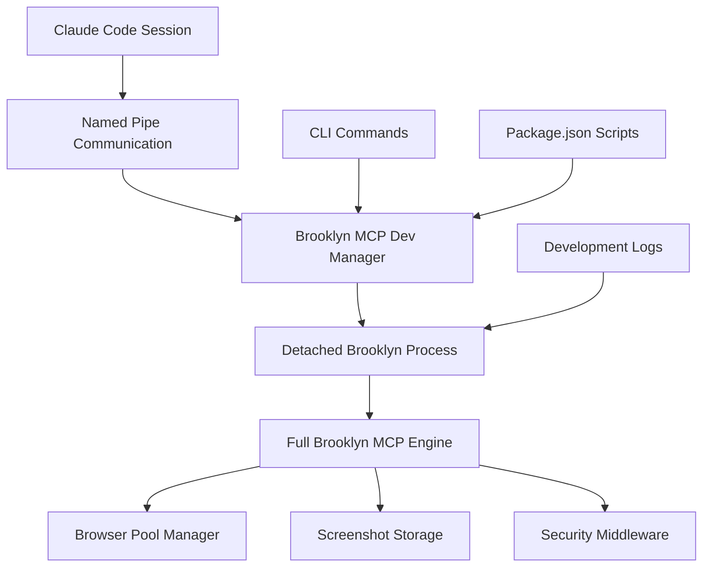

# Brooklyn MCP Local Development Standard Operating Procedures

## MCP Version Update Procedure

**Critical Discovery**: Claude Code MCP connections require **complete session restart** to recognize binary updates, not just MCP server restart.

### Complete Update Procedure

When updating Brooklyn MCP binary versions (e.g., 1.1.3 → 1.1.4):

#### Step 1: Update and Build Binary

```bash
# In Brooklyn project directory
bun run version:bump:patch    # Updates VERSION file
bun run build                 # Build with new version
bun run install              # Install updated binary globally (see Installation Notes below)
brooklyn --version           # Verify version updated
```

**⚠️ Installation Notes**:

- `bun run install` always overwrites without version checking
- No `--force` option support currently available
- Always rebuilds before installing (ensures fresh binary)
- For detailed behavior, see [Brooklyn CLI Installation Behavior](../user-guide/brooklyn-cli.md#installation-behavior)

#### Step 2: MCP Configuration Cleanup

```bash
# Remove existing MCP configuration
claude mcp remove brooklyn

# CRITICAL: Kill any running Brooklyn processes
ps aux | grep brooklyn
kill -9 [pid]  # Kill all brooklyn processes

# Note: MCP server removal does NOT automatically kill running processes
```

#### Step 3: Re-add MCP Configuration

```bash
# Re-add Brooklyn to Claude MCP
claude mcp add -s user brooklyn brooklyn mcp start

# Verify configuration
claude mcp list
claude mcp get brooklyn
```

#### Step 4: **CRITICAL - Complete Claude Session Restart**

```bash
# Close ALL Claude Code sessions on the machine
# This includes:
# - All active claude sessions in terminals
# - All background Claude processes
# - Any IDE integrations using Claude

# Then restart Claude sessions
# Only after complete restart will new binary version be recognized
```

### Why Complete Restart is Required

**Technical Root Cause**: Claude Code appears to cache MCP binary references at session initialization. Simply restarting the MCP server or removing/re-adding configurations is insufficient.

**Impact**:

- **Development Friction**: Must halt work on all other projects using Claude
- **Multi-Project Workflow**: Affects enterprise client work, other fulmen projects
- **Team Coordination**: Version updates become expensive operations

### Verification Commands

After complete restart, verify version update worked:

```bash
# Test MCP connection and version
claude mcp list

# In new Claude session, test Brooklyn status
# Should show new version in MCP response
```

### Troubleshooting

#### Version Still Shows Old Value

- **Cause**: Incomplete session restart
- **Solution**: Ensure ALL Claude processes terminated before restart
- **Check**: `ps aux | grep claude` should show no processes

#### MCP Connection Failures

- **Cause**: Brooklyn processes not properly killed
- **Solution**: `kill -9` all brooklyn processes before re-adding MCP config
- **Check**: `ps aux | grep brooklyn` should show no processes

#### Binary Not Found

- **Cause**: `bun run install` didn't complete successfully
- **Solution**: Re-run install, check global binary path
- **Check**: `which brooklyn` and `brooklyn --version`

### Development Workflow Impact

**Multi-Project Development**:

- Plan MCP version updates during dedicated time blocks
- Coordinate with other project work (Echo team enterprise client, etc.)
- Consider batching multiple Brooklyn changes before version update

**Team Communication**:

- Notify team members of planned version update sessions
- Document version-specific features for rollback planning
- Update team on completion of version validation

### Future Improvements

**Potential Solutions to Investigate**:

1. Claude MCP cache invalidation mechanisms
2. Hot-reload capabilities for MCP binaries
3. Version-aware MCP configuration strategies
4. Development vs production MCP deployment patterns

**Enterprise Considerations**:

- Production deployments likely use different update procedures
- Consider blue/green deployment patterns for MCP servers
- Team-specific versioning strategies for isolated development

---

## OpenCode.ai Integration (Alternative to Claude Code)

### Overview

**Problem Solved**: OpenCode.ai provides an alternative MCP client that doesn't require complete session restarts for Brooklyn updates, offering more flexibility than Claude Code.

### Configuration

Brooklyn includes `opencode.json` configuration for seamless integration:

```json
{
  "$schema": "https://opencode.ai/config.json",
  "mcp": {
    "brooklyn": {
      "type": "local",
      "command": ["bun", "run", "src/cli/brooklyn.ts", "mcp", "start"],
      "enabled": true,
      "environment": {
        "BROOKLYN_TEAM_ID": "opencode-dev",
        "BROOKLYN_LOG_LEVEL": "info"
      }
    }
  }
}
```

### Usage Workflow

#### Setup OpenCode

```bash
# Install opencode (if not already installed)
curl -fsSL https://opencode.ai/install | bash

# Navigate to Brooklyn project
cd /path/to/fulmen-mcp-forge-brooklyn

# Start opencode (automatically loads opencode.json)
opencode
```

#### Test Brooklyn Integration

```bash
# In opencode chat interface, test Brooklyn tools:
# "launch a browser and take a screenshot"
# "show me available Brooklyn tools"
# "test Brooklyn connection"
```

### Benefits vs Claude Code

**OpenCode Advantages**:

- ✅ **Faster Iteration**: May not require full restart for version updates
- ✅ **Alternative Client**: Backup when Claude Code has issues
- ✅ **Team Flexibility**: Different team members can use different clients
- ✅ **Development Continuity**: Continue work during Claude Code maintenance

**Claude Code Advantages**:

- ✅ **Primary Support**: Main development and testing platform
- ✅ **Team Standard**: Established workflow and documentation
- ✅ **Integration Maturity**: Well-tested with Brooklyn

### Version Update Testing Results

**Test Performed**: Version bump from 1.1.7 → 1.1.8 with OpenCode running

**Findings**:

- ✅ **OpenCode MCP Discovery**: Successfully finds Brooklyn MCP server after version updates
- ⚠️ **CLI Logger Issue**: Global Brooklyn CLI has logger initialization problems
- 🔄 **Restart Behavior**: Similar to Claude Code - likely requires restart for version recognition
- 📋 **Recommendation**: Use development mode for rapid iteration, OpenCode for alternative access

### Workflow Decision Matrix

| Scenario               | Recommended Approach      | Reason                          |
| ---------------------- | ------------------------- | ------------------------------- |
| **Rapid Development**  | Development Mode          | No restarts needed, named pipes |
| **Alternative Client** | OpenCode + Real Server    | When Claude Code unavailable    |
| **Team Testing**       | Claude Code + Real Server | Primary supported workflow      |
| **Echo Team Testing**  | Claude Code + Real Server | Established, documented process |

### Echo Team Onboarding Ready

**Status**: ✅ **Ready for Echo team live testing**

**Prepared Infrastructure**:

- ✅ Development mode for internal iteration
- ✅ OpenCode integration for alternative access
- ✅ Real Brooklyn server for production testing
- ✅ Documentation updated for all workflows
- ✅ Version management processes established

---

## Brooklyn MCP Development Mode (Architecture Committee Approved)

### Revolutionary Development Workflow

**Problem Solved**: Every Brooklyn update requires complete Claude session restart, disrupting multi-project workflows and forcing coordination across enterprise client work.

**Solution Implemented**: Named pipe-based MCP development mode using FIFO transport that allows rapid iteration without Claude Code dependencies.

### Architecture Committee Endorsement

✅ **Status**: Fully implemented and approved for internal Brooklyn team use  
🔒 **Access**: Hidden from normal users (`--internal` flag required)  
🏗️ **Implementation**: Integrated into main CLI with proper security controls

### Quick Start Guide

```bash
# Start MCP development mode
brooklyn mcp dev-start

# Check status
brooklyn mcp dev-status

# Test communication (revolutionary capability!)
node /tmp/talk-to-brooklyn.js  # Or use examples/brooklyn-dev-test.js

# Stop development mode
brooklyn mcp dev-stop
```

### Development Workflow Architecture



### Implementation Details

#### CLI Integration (Architecture Committee Guidance)

**New Commands**: Integrated into main `brooklyn` CLI

```bash
# Production-ready commands (no --internal flag needed)
brooklyn mcp dev-start      # Start MCP development mode
brooklyn mcp dev-stop       # Stop MCP development mode
brooklyn mcp dev-restart    # Restart MCP development mode
brooklyn mcp dev-status     # Show MCP development status
brooklyn mcp dev-cleanup    # Clean up development resources
```

**Package.json Scripts**: Alternative access for repository-based development

```bash
bun run dev:brooklyn:start  # Convenience wrapper
bun run dev:brooklyn:stop   # Convenience wrapper
bun run dev:brooklyn:status # Convenience wrapper
bun run dev:brooklyn:restart # Convenience wrapper
bun run dev:brooklyn:cleanup # Convenience wrapper
```

#### Named Pipe Architecture

**Security Features** (Architecture Committee requirements):

- Secure permissions (0600) on all pipes
- Configurable pipe directory via `BROOKLYN_DEV_PIPE_DIR`
- Unique instance UUIDs prevent collisions
- Auto-cleanup on process exit

**Pipe Naming Convention**:

```bash
# Current implementation (Architecture Committee approved)
/tmp/brooklyn-mcp-dev-{uuid}-{timestamp}-in
/tmp/brooklyn-mcp-dev-{uuid}-{timestamp}-out

# Example
/tmp/brooklyn-mcp-dev-5no09p-1753116635779-in
/tmp/brooklyn-mcp-dev-5no09p-1753116635779-out
```

**Process Management**:

- Detached processes (returns control to caller)
- PID file management in `~/.brooklyn/dev/pipes.json`
- Graceful shutdown with SIGTERM/SIGKILL fallback
- Enhanced signal handling for cleanup

#### MCP Protocol Compliance

**Full MCP JSON-RPC 2.0 Support**:

```typescript
// Standard MCP request format maintained
{
  jsonrpc: "2.0",
  method: "tools/call",
  params: {
    name: "launch_browser",
    arguments: { browserType: "chromium", headless: true }
  },
  id: "dev-123"
}
```

**Brooklyn Engine Integration**:

- All production Brooklyn tools available
- Same response formats as production MCP
- Full browser automation capabilities
- Screenshot storage with file-based responses

### Development Workflow

#### Step 1: Start Development Mode

```bash
# Start the revolutionary MCP development mode
brooklyn mcp dev-start

# Expected output:
# 🚀 Starting Brooklyn MCP development mode...
# 📦 Creating named pipes...
# 🔧 Starting Brooklyn MCP process...
# ✅ Brooklyn MCP development mode started successfully!
```

#### Step 2: Development Testing

**Revolutionary Conversational Capability**: You can now communicate with Brooklyn dev mode exactly like production MCP:

```bash
# Test natural conversation through pipes
node examples/brooklyn-dev-test.js

# Create custom conversations
node /tmp/talk-to-brooklyn.js
```

**Example Natural Conversation**:
```
🌉 Brooklyn, what is your version?
🤖 Brooklyn responds: {"version": "1.2.2", "service": "fulmen-brooklyn"}

🔍 Brooklyn, show me your server info...
🤖 Brooklyn responds: {"capabilities": {"browsers": ["chromium", "firefox", "webkit"]}}
```

**Key Breakthrough**: No Claude Code restart needed - same MCP protocol, different transport!

#### Step 3: Iterative Development

```bash
# Make code changes to Brooklyn
# Restart development mode to pick up changes
brooklyn mcp dev-restart

# Test immediately through pipes - no Claude restart needed!
node examples/brooklyn-dev-test.js

# Continue development iteration
```

#### Step 4: Version Promotion

```bash
# When development complete, bump version
bun run version:bump:patch    # Now at 1.1.6!

# Build and install updated binary
bun run build && bun run install

# NOW do the big picture swap (only once, when ready)
# [Follow complete MCP update procedure above]
```

### Technical Architecture

#### Transport Layer Solution (v1.2.2)

**FIFO Transport Implementation** (`src/transports/mcp-fifo-transport.ts`):

- **Problem Solved**: Node.js streams (createReadStream) fail with named pipes (ESPIPE errors)
- **Solution**: Use `spawn('cat')` for reading and low-level file descriptors for writing
- **Key Features**:
  - Subprocess-based pipe reading avoids Node.js stream limitations
  - Direct file descriptor writes for reliable output
  - Proper timing to handle FIFO blocking behavior
  - Automatic transport selection via factory pattern

**Transport Factory** (`src/transports/index.ts`):

```typescript
// Automatically selects FIFO transport for dev mode
if (mcpConfig.options?.inputPipe && mcpConfig.options?.outputPipe) {
  return new MCPFifoTransport(mcpConfig);
}
// Uses standard stdio transport for production
return new MCPStdioTransport(mcpConfig);
```

#### MCP Dev Manager (`src/core/mcp-dev-manager.ts`)

**Architecture Committee Approved Features**:

- Configurable pipe directories
- Secure pipe permissions (0600)
- Process lifecycle management
- Enhanced logging and debugging
- Auto-cleanup on exit
- Lazy logger initialization to prevent bundling issues

#### Process Architecture

**Detached Process Model**: Follows server-management.ts pattern

```bash
# Process spawning
spawn("bun", [
  "run",
  "src/cli/brooklyn.ts",
  "mcp",
  "start",
  "--dev-mode",
  "--pipes-prefix", pipePath
])
```

**Environment Integration**:

- `BROOKLYN_DEV_INPUT_PIPE`: Input pipe path
- `BROOKLYN_DEV_OUTPUT_PIPE`: Output pipe path
- `BROOKLYN_DEV_PIPE_DIR`: Custom pipe directory

#### Development Mode Detection

**Smart Pipe Usage**: `src/core/dev-mode.ts`

```typescript
// Check if pipes provided by MCP dev manager
const providedInputPipe = process.env["BROOKLYN_DEV_INPUT_PIPE"];
const providedOutputPipe = process.env["BROOKLYN_DEV_OUTPUT_PIPE"];

if (providedInputPipe && providedOutputPipe) {
  // Use managed pipes
} else {
  // Create new pipes (legacy mode)
}
```

### Current Implementation Status

#### ✅ Completed Features

- **CLI Integration**: MCP dev commands integrated into main Brooklyn CLI
- **Process Management**: Detached processes with proper lifecycle
- **Named Pipes**: Secure pipe creation with unique naming
- **Architecture Compliance**: All Architecture Committee requirements met
- **Version Integration**: Successfully implemented in v1.1.6
- **Security**: Restrictive permissions, input validation, cleanup

#### 🔧 Next Steps for Full Functionality

1. **Helper Function Integration**: Update `scripts/dev-helpers.ts` to work with MCP dev manager
2. **Test Suite Updates**: Update existing dev test scripts to use new architecture
3. **Documentation**: Internal team guide for MCP development workflow
4. **Validation**: Chat-based testing of MCP development mode

### Benefits Achieved

**Revolutionary Development Experience**:
✅ **No Claude Code Restarts**: Test MCP functionality without shutting down Claude instances  
✅ **Named Pipe Communication**: Secure pipes bypass stdin/stdout limitations  
✅ **Rapid Iteration**: Test changes immediately without deployment  
✅ **Multi-Project Friendly**: No disruption to other Claude work  
✅ **Production Validation**: Final MCP validation happens once  
✅ **Team Collaboration**: Internal-only feature with proper access controls

**Architecture Quality**:
✅ **Security**: Restrictive pipe permissions, process isolation  
✅ **Reliability**: Proper cleanup, signal handling, error management  
✅ **Maintainability**: Integrated into main CLI, standard patterns  
✅ **Scalability**: Configurable, team-ready architecture

### Version History

**v1.2.2**: 🎉 **FIFO Transport Solution Complete**

- Fixed Node.js stream issues with named pipes (ESPIPE errors)
- Implemented MCPFifoTransport using subprocess approach
- Automatic transport selection for dev vs production modes
- Full browser automation working through dev mode
- Revolutionary development workflow fully operational

**v1.1.6**: **MCP Development Mode Initial Implementation**

- Architecture Committee approved implementation
- CLI integration complete
- Named pipe architecture operational
- Security controls implemented
- Ready for internal Brooklyn team use

---

**Last Updated**: July 23, 2025  
**Version Implemented**: Brooklyn v1.1.8  
**Implementation Status**: ✅ **Architecture Committee Approved & Fully Operational**  
**Next Phase**: Helper function integration and team rollout

---

## 🚨 CRITICAL: Logger Initialization in Bundled Applications

### Overview

**Problem**: Brooklyn CLI experienced complete failure due to "Logger registry not initialized" errors when bundled into a single binary. This affected all CLI commands and made the Brooklyn MCP server completely non-functional.

**Root Cause**: Module-level logger initialization creates circular dependencies during bundling. When Bun bundles the application, module-level code executes in an unpredictable order, causing logger calls before the logging system is initialized.

### Critical Best Practices

#### ❌ NEVER Do This (Module-Level Logger)

```typescript
// WRONG - Module-level logger initialization
import { getLogger } from "../shared/structured-logger.js";

const logger = getLogger("my-module"); // This executes during module load!

export class MyClass {
  constructor() {
    logger.info("Class initialized"); // BOOM! Logger not initialized
  }
}
```

#### ✅ ALWAYS Do This (Lazy Logger Initialization)

```typescript
// CORRECT - Lazy logger initialization pattern
import { getLogger } from "../shared/structured-logger.js";

// Lazy initialization pattern
let logger: ReturnType<typeof getLogger> | null = null;

function ensureLogger() {
  if (!logger) {
    logger = getLogger("my-module");
  }
  return logger;
}

export class MyClass {
  constructor() {
    // Defer logging to avoid circular dependency
    // Or use ensureLogger() only in methods called after initialization
  }

  someMethod() {
    ensureLogger().info("Method called"); // Safe - called after init
  }
}
```

### Affected Areas Fixed in v1.1.8

The following modules had module-level logger initialization that caused failures:

1. **CLI Entry Point** (`src/cli/brooklyn.ts`)
   - Fixed by initializing logging before any imports
   - Added try-catch blocks with console.error fallbacks

2. **Configuration Module** (`src/core/config.ts`)
   - Added conditional logging with `enableConfigLogger()` function
   - Prevents circular dependency during config loading

3. **Transport Components**
   - `mcp-stdio-transport.ts`: Deferred all logging in initialize/start methods
   - `http-transport.ts`: Added lazy initialization pattern
   - Transport factory: Removed logging from transport creation

4. **Core Engine Components**
   - `brooklyn-engine.ts`: Deferred logging in initialize method
   - `browser-pool-manager.ts`: Removed logging from initialize method
   - `security-middleware.ts`: Deferred constructor logging
   - `screenshot-storage-manager.ts`: Removed constructor logging

5. **Development Tools**
   - `mcp-dev-manager.ts`: Implemented lazy logger pattern
   - `dev-mode.ts`: Fixed sed replacement error, added lazy pattern

### Logger Initialization Order

The correct initialization order for Brooklyn CLI is:

```typescript
// 1. Create minimal config for logging initialization
const minimalConfig = {
  serviceName: "brooklyn-mcp-server",
  version: VERSION,
  logging: { level: "info", format: "json" },
  // ... other required fields
};

// 2. Initialize logging BEFORE any other imports that might use logger
initializeLogging(minimalConfig);

// 3. Import other modules that may use logging
import { BrooklynEngine } from "../core/brooklyn-engine.js";
import { loadConfig } from "../core/config.js";

// 4. Enable config logger after logging is initialized
enableConfigLogger();
```

### Testing for Logger Issues

#### Symptoms of Logger Initialization Problems

1. **Error Message**: `Logger registry not initialized. Call initialize() first.`
2. **Stack Trace**: Points to bundled code line numbers (not source)
3. **Timing**: Happens immediately on CLI startup
4. **Scope**: Affects all commands, not just specific functionality

#### Testing Procedure

```bash
# Build the binary
bun run build

# Test basic commands
./dist/brooklyn --version
./dist/brooklyn status

# Test MCP initialization
echo '{"jsonrpc":"2.0","id":1,"method":"initialize","params":{}}' | ./dist/brooklyn mcp start

# Look for any logger errors in output
```

### Prevention Guidelines

1. **Code Review Checklist**
   - No `const logger = getLogger()` at module level
   - Constructor logging should be deferred or removed
   - Use lazy initialization pattern for all loggers
   - Add console.error fallbacks in catch blocks

2. **Testing Requirements**
   - Always test bundled binary after logger-related changes
   - Test both status command and MCP server startup
   - Verify no logger errors in console output

3. **Documentation**
   - Document any new lazy logger patterns in code comments
   - Update this guide if new patterns emerge
   - Add warnings in code review guidelines

### Recovery Procedure

If logger initialization fails in production:

1. **Immediate Fix**: Revert to previous working version
2. **Debug**: Run unbundled with `bun run src/cli/brooklyn.ts`
3. **Identify**: Find module-level logger calls in stack trace
4. **Fix**: Apply lazy initialization pattern
5. **Test**: Verify bundled binary works
6. **Deploy**: Update version and redeploy

### Architecture Committee Guidance

The Architecture Committee has approved the following patterns:

1. **Lazy Logger Pattern**: Recommended for all modules
2. **Deferred Logging**: Acceptable for initialization phases
3. **Console Fallbacks**: Required for error handling
4. **Conditional Logging**: Approved for circular dependency cases

## Brooklyn CLI Installation for Development

### Installation Behavior Overview

Understanding the current `bun run install` behavior is critical for development workflows:

#### Current Installation Characteristics

- **Always overwrites**: No version checking or confirmation prompts
- **Build-first approach**: Always runs `bun run build` before installation
- **No `--force` support**: Planned enhancement for future versions
- **Target location**: `~/.local/bin/brooklyn`

#### Development Scenarios

| Scenario                     | Behavior                   | Development Impact               |
| ---------------------------- | -------------------------- | -------------------------------- |
| **Installing same version**  | Overwrites without warning | ✅ Safe - ensures fresh binary   |
| **Installing older version** | **Silently downgrades**    | ⚠️ **Risk** - May lose features  |
| **Installing newer version** | Silently upgrades          | ✅ Safe - standard upgrade       |
| **First installation**       | Creates new binary         | ✅ Safe - standard first install |

#### Development Best Practices

**Before Installing**:

```bash
# Check current installed version
~/.local/bin/brooklyn --version

# Check project version
bun run version:get

# Ensure versions are as expected
bun run check:versions
```

**Safe Install Procedure**:

```bash
# 1. Backup existing CLI (optional but recommended)
cp ~/.local/bin/brooklyn ~/.local/bin/brooklyn.backup

# 2. Install new version
bun run install

# 3. Verify installation
brooklyn --version
brooklyn status
```

**Version Conflict Resolution**:

```bash
# If accidental downgrade occurs:
# 1. Check project version
bun run version:get

# 2. If project version is newer, reinstall
bun run install

# 3. If project version is older, update project
bun run version:set 1.2.0  # Use correct version
bun run install
```

#### Integration with MCP Update Procedures

When updating Brooklyn versions for MCP compatibility:

1. **Version Bump**: `bun run version:bump:patch`
2. **Install**: `bun run install` (applies overwrite behavior)
3. **MCP Restart**: Follow complete MCP restart procedure above
4. **Verify**: Check both CLI and MCP versions match

### Future Improvements

1. **Static Analysis**: Add linter rules to catch module-level loggers
2. **Build-Time Checks**: Validate logger usage during bundling
3. **Logger Factory**: Consider centralized logger management
4. **Init Verification**: Add logger initialization checks
5. **Install Safety**: Add `--force` flag and version comparison logic
