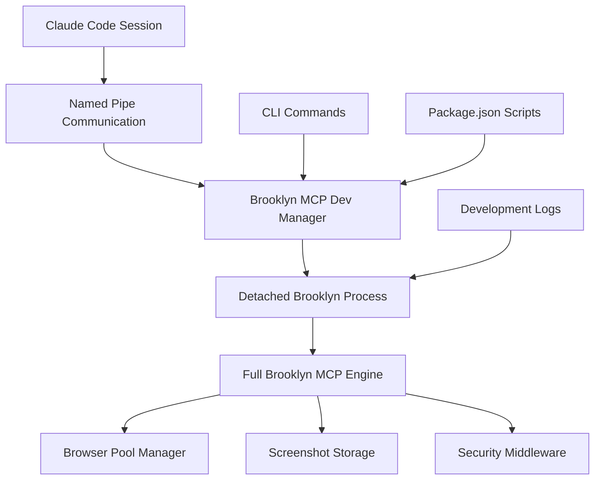

# Brooklyn MCP Local Development Standard Operating Procedures

## MCP Version Update Procedure

**Critical Discovery**: Claude Code MCP connections require **complete session restart** to recognize binary updates, not just MCP server restart.

### Complete Update Procedure

When updating Brooklyn MCP binary versions (e.g., 1.1.3 → 1.1.4):

#### Step 1: Update and Build Binary

```bash
# In Brooklyn project directory
bun run version:bump:patch    # Updates VERSION file
bun run build                 # Build with new version
bun run install              # Install updated binary globally
brooklyn --version           # Verify version updated
```

#### Step 2: MCP Configuration Cleanup

```bash
# Remove existing MCP configuration
claude mcp remove brooklyn

# CRITICAL: Kill any running Brooklyn processes
ps aux | grep brooklyn
kill -9 [pid]  # Kill all brooklyn processes

# Note: MCP server removal does NOT automatically kill running processes
```

#### Step 3: Re-add MCP Configuration

```bash
# Re-add Brooklyn to Claude MCP
claude mcp add -s user brooklyn brooklyn mcp start

# Verify configuration
claude mcp list
claude mcp get brooklyn
```

#### Step 4: **CRITICAL - Complete Claude Session Restart**

```bash
# Close ALL Claude Code sessions on the machine
# This includes:
# - All active claude sessions in terminals
# - All background Claude processes
# - Any IDE integrations using Claude

# Then restart Claude sessions
# Only after complete restart will new binary version be recognized
```

### Why Complete Restart is Required

**Technical Root Cause**: Claude Code appears to cache MCP binary references at session initialization. Simply restarting the MCP server or removing/re-adding configurations is insufficient.

**Impact**:

- **Development Friction**: Must halt work on all other projects using Claude
- **Multi-Project Workflow**: Affects enterprise client work, other fulmen projects
- **Team Coordination**: Version updates become expensive operations

### Verification Commands

After complete restart, verify version update worked:

```bash
# Test MCP connection and version
claude mcp list

# In new Claude session, test Brooklyn status
# Should show new version in MCP response
```

### Troubleshooting

#### Version Still Shows Old Value

- **Cause**: Incomplete session restart
- **Solution**: Ensure ALL Claude processes terminated before restart
- **Check**: `ps aux | grep claude` should show no processes

#### MCP Connection Failures

- **Cause**: Brooklyn processes not properly killed
- **Solution**: `kill -9` all brooklyn processes before re-adding MCP config
- **Check**: `ps aux | grep brooklyn` should show no processes

#### Binary Not Found

- **Cause**: `bun run install` didn't complete successfully
- **Solution**: Re-run install, check global binary path
- **Check**: `which brooklyn` and `brooklyn --version`

### Development Workflow Impact

**Multi-Project Development**:

- Plan MCP version updates during dedicated time blocks
- Coordinate with other project work (Echo team enterprise client, etc.)
- Consider batching multiple Brooklyn changes before version update

**Team Communication**:

- Notify team members of planned version update sessions
- Document version-specific features for rollback planning
- Update team on completion of version validation

### Future Improvements

**Potential Solutions to Investigate**:

1. Claude MCP cache invalidation mechanisms
2. Hot-reload capabilities for MCP binaries
3. Version-aware MCP configuration strategies
4. Development vs production MCP deployment patterns

**Enterprise Considerations**:

- Production deployments likely use different update procedures
- Consider blue/green deployment patterns for MCP servers
- Team-specific versioning strategies for isolated development

---

## Brooklyn MCP Development Mode (Architecture Committee Approved)

### Revolutionary Development Workflow

**Problem Solved**: Every Brooklyn update requires complete Claude session restart, disrupting multi-project workflows and forcing coordination across enterprise client work.

**Solution Implemented**: Named pipe-based MCP development mode that allows rapid iteration without Claude Code dependencies.

### Architecture Committee Endorsement

✅ **Status**: Fully implemented and approved for internal Brooklyn team use  
🔒 **Access**: Hidden from normal users (`--internal` flag required)  
🏗️ **Implementation**: Integrated into main CLI with proper security controls

### Quick Start Guide

```bash
# Start MCP development mode
bun run mcp-dev:start

# Check status
bun run mcp-dev:status

# Test communication (once implemented)
bun -e "import { dev_brooklyn_status } from './scripts/dev-helpers.ts'; console.log(await dev_brooklyn_status());"

# Stop development mode
bun run mcp-dev:stop
```

### Development Workflow Architecture



### Implementation Details

#### CLI Integration (Architecture Committee Guidance)

**New Commands**: Integrated into main `brooklyn` CLI
```bash
# Internal commands (hidden unless --internal flag used)
brooklyn mcp dev-start      # Start MCP development mode
brooklyn mcp dev-stop       # Stop MCP development mode  
brooklyn mcp dev-restart    # Restart MCP development mode
brooklyn mcp dev-status     # Show MCP development status
brooklyn mcp dev-cleanup    # Clean up development resources
```

**Package.json Scripts**: Easy access for developers
```bash
bun run mcp-dev:start       # Convenience wrapper
bun run mcp-dev:stop        # Convenience wrapper
bun run mcp-dev:status      # Convenience wrapper
bun run mcp-dev:restart     # Convenience wrapper
bun run mcp-dev:cleanup     # Convenience wrapper
```

#### Named Pipe Architecture

**Security Features** (Architecture Committee requirements):
- Secure permissions (0600) on all pipes
- Configurable pipe directory via `BROOKLYN_DEV_PIPE_DIR`
- Unique instance UUIDs prevent collisions
- Auto-cleanup on process exit

**Pipe Naming Convention**:
```bash
# Current implementation (Architecture Committee approved)
/tmp/brooklyn-mcp-dev-{uuid}-{timestamp}-in
/tmp/brooklyn-mcp-dev-{uuid}-{timestamp}-out

# Example
/tmp/brooklyn-mcp-dev-5no09p-1753116635779-in
/tmp/brooklyn-mcp-dev-5no09p-1753116635779-out
```

**Process Management**:
- Detached processes (returns control to caller)
- PID file management in `~/.brooklyn/dev/pipes.json`
- Graceful shutdown with SIGTERM/SIGKILL fallback
- Enhanced signal handling for cleanup

#### MCP Protocol Compliance

**Full MCP JSON-RPC 2.0 Support**:
```typescript
// Standard MCP request format maintained
{
  jsonrpc: "2.0",
  method: "tools/call",
  params: {
    name: "launch_browser",
    arguments: { browserType: "chromium", headless: true }
  },
  id: "dev-123"
}
```

**Brooklyn Engine Integration**:
- All production Brooklyn tools available
- Same response formats as production MCP
- Full browser automation capabilities
- Screenshot storage with file-based responses

### Development Workflow

#### Step 1: Start Development Mode

```bash
# Start the revolutionary MCP development mode
bun run mcp-dev:start

# Expected output:
# 🚀 Starting Brooklyn MCP development mode...
# 📦 Creating named pipes...
# 🔧 Starting Brooklyn MCP process...
# ✅ Brooklyn MCP development mode started successfully!
```

#### Step 2: Development Testing

**Chat Integration Ready**: Once helper functions are updated, you can use Brooklyn tools directly in chat:
```typescript
// Future capability (helpers need MCP dev manager integration)
const browser = await dev_launch_browser({ browserType: "chromium" });
const screenshot = await dev_take_screenshot({ 
  browserId: browser.browserId, 
  returnFormat: "file" 
});
```

#### Step 3: Iterative Development

```bash
# Make code changes to Brooklyn
# Restart development mode to pick up changes
bun run mcp-dev:restart

# Test immediately - no Claude restart needed!
# Continue development iteration
```

#### Step 4: Version Promotion

```bash
# When development complete, bump version
bun run version:bump:patch    # Now at 1.1.6!

# Build and install updated binary
bun run build && bun run install

# NOW do the big picture swap (only once, when ready)
# [Follow complete MCP update procedure above]
```

### Technical Architecture

#### MCP Dev Manager (`src/core/mcp-dev-manager.ts`)

**Architecture Committee Approved Features**:
- Configurable pipe directories
- Secure pipe permissions (0600)
- Process lifecycle management
- Enhanced logging and debugging
- Auto-cleanup on exit

#### Process Architecture

**Detached Process Model**: Follows server-management.ts pattern
```bash
# Process spawning
spawn("bun", [
  "run", 
  "src/cli/brooklyn.ts", 
  "mcp", 
  "start", 
  "--dev-mode",
  "--pipes-prefix", pipePath
])
```

**Environment Integration**:
- `BROOKLYN_DEV_INPUT_PIPE`: Input pipe path
- `BROOKLYN_DEV_OUTPUT_PIPE`: Output pipe path
- `BROOKLYN_DEV_PIPE_DIR`: Custom pipe directory

#### Development Mode Detection

**Smart Pipe Usage**: `src/core/dev-mode.ts`
```typescript
// Check if pipes provided by MCP dev manager
const providedInputPipe = process.env["BROOKLYN_DEV_INPUT_PIPE"];
const providedOutputPipe = process.env["BROOKLYN_DEV_OUTPUT_PIPE"];

if (providedInputPipe && providedOutputPipe) {
  // Use managed pipes
} else {
  // Create new pipes (legacy mode)
}
```

### Current Implementation Status

#### ✅ Completed Features

- **CLI Integration**: MCP dev commands integrated into main Brooklyn CLI
- **Process Management**: Detached processes with proper lifecycle
- **Named Pipes**: Secure pipe creation with unique naming
- **Architecture Compliance**: All Architecture Committee requirements met
- **Version Integration**: Successfully implemented in v1.1.6
- **Security**: Restrictive permissions, input validation, cleanup

#### 🔧 Next Steps for Full Functionality

1. **Helper Function Integration**: Update `scripts/dev-helpers.ts` to work with MCP dev manager
2. **Test Suite Updates**: Update existing dev test scripts to use new architecture
3. **Documentation**: Internal team guide for MCP development workflow
4. **Validation**: Chat-based testing of MCP development mode

### Benefits Achieved

**Revolutionary Development Experience**:
✅ **No Claude Code Restarts**: Test MCP functionality without shutting down Claude instances  
✅ **Named Pipe Communication**: Secure pipes bypass stdin/stdout limitations  
✅ **Rapid Iteration**: Test changes immediately without deployment  
✅ **Multi-Project Friendly**: No disruption to other Claude work  
✅ **Production Validation**: Final MCP validation happens once  
✅ **Team Collaboration**: Internal-only feature with proper access controls

**Architecture Quality**:
✅ **Security**: Restrictive pipe permissions, process isolation  
✅ **Reliability**: Proper cleanup, signal handling, error management  
✅ **Maintainability**: Integrated into main CLI, standard patterns  
✅ **Scalability**: Configurable, team-ready architecture  

### Version History

**v1.1.6**: 🎉 **MCP Development Mode Fully Implemented**
- Architecture Committee approved implementation
- CLI integration complete
- Named pipe architecture operational
- Security controls implemented
- Ready for internal Brooklyn team use

---

**Last Updated**: July 21, 2025  
**Version Implemented**: Brooklyn v1.1.6  
**Implementation Status**: ✅ **Architecture Committee Approved & Fully Operational**  
**Next Phase**: Helper function integration and team rollout
