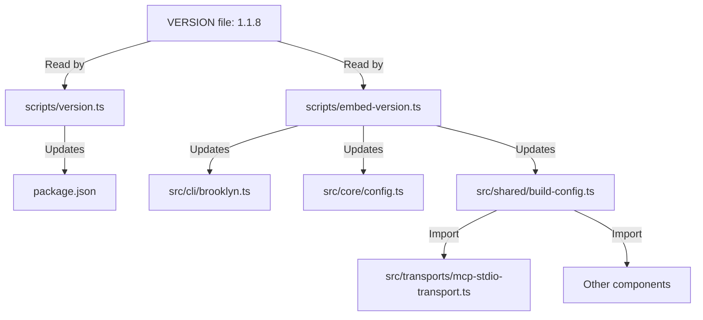

# Brooklyn Version Management Standard Operating Procedures

## Overview

Brooklyn uses a sophisticated version management system that balances simplicity with flexibility. This document outlines the complete architecture and procedures for managing versions across the codebase.

## Architecture Summary

### Single Source of Truth

- **VERSION file**: Contains the canonical version (e.g., `1.1.8`)
- **package.json**: Synced with VERSION file via `bun run version:bump:*` commands
- **build-config.ts**: Central configuration imported by components

### Two-Tier Approach

1. **Static Embedding**: Required for CLI entry points and core config
2. **Dynamic Imports**: Used by components that can import at runtime

## Version Management Flow



## Standard Operating Procedures

### 1. Version Bumping (MANDATORY Process)

**❌ NEVER edit VERSION or package.json manually**

```bash
# Patch version (1.1.8 → 1.1.9)
bun run version:bump:patch

# Minor version (1.1.8 → 1.2.0)
bun run version:bump:minor

# Major version (1.1.8 → 2.0.0)
bun run version:bump:major

# Set specific version
bun run version:set 1.2.3
```

### 2. Build Process (Complete Workflow)

```bash
# 1. Version bump (if needed)
bun run version:bump:patch

# 2. Embed version in source files
bun run version:embed

# 3. Build CLI binary
bun run build

# 4. Install globally (optional)
bun run install
```

### 3. Version Verification

```bash
# Check version consistency
bun run check:versions

# Fix version inconsistencies
bun run check:versions:fix

# Get current version
bun run version:get
```

## Implementation Details

### Static Embedding (3 Files)

#### 1. CLI Entry Point

```typescript
// src/cli/brooklyn.ts
const VERSION = "1.1.8"; // Embedded at build time
```

#### 2. Core Configuration

```typescript
// src/core/config.ts
export function createDefaultConfig(): BrooklynConfig {
  return {
    serviceName: "brooklyn-mcp-server",
    version: "1.1.8", // Embedded at build time
    // ...
  };
}
```

#### 3. Build Configuration (Central Source)

```typescript
// src/shared/build-config.ts
export const buildConfig = {
  serviceName: "fulmen-brooklyn",
  displayName: "Fulmen MCP Brooklyn",
  version: "1.1.8", // Synced from VERSION file
  // ...
};
```

### Dynamic Imports (Preferred Pattern)

```typescript
// src/transports/mcp-stdio-transport.ts
import { buildConfig } from "../shared/build-config.js";

// In MCP initialize response:
serverInfo: {
  name: "brooklyn-mcp-server",
  version: buildConfig.version  // Dynamic import
}
```

## Embed Version Script Details

### Files Updated by embed-version.ts

| File                         | Pattern                    | Purpose             |
| ---------------------------- | -------------------------- | ------------------- |
| `src/cli/brooklyn.ts`        | `const VERSION = "X.X.X";` | CLI version display |
| `src/core/config.ts`         | `version: "X.X.X",`        | Core config default |
| `src/shared/build-config.ts` | `version: "X.X.X",`        | Central source      |

### Script Features

- **Idempotent**: Safe to run multiple times
- **Pattern Matching**: Uses regex to find and replace version strings
- **Validation**: Checks if version is already current
- **Error Handling**: Fails build if patterns not found

## Development Guidelines

### Adding New Components

#### ✅ Preferred: Dynamic Import

```typescript
import { buildConfig } from "../shared/build-config.js";

export class MyComponent {
  getVersion(): string {
    return buildConfig.version;
  }
}
```

#### ❌ Avoid: Static Embedding

```typescript
// Don't add more files to embed-version.ts unless absolutely necessary
const VERSION = "1.1.8"; // Requires build-time embedding
```

### When to Use Each Approach

| Use Case               | Approach         | Reason                   |
| ---------------------- | ---------------- | ------------------------ |
| **CLI Entry Points**   | Static Embedding | Must work before imports |
| **Core Configuration** | Static Embedding | Bootstrap requirement    |
| **MCP Transports**     | Dynamic Import   | Runtime flexibility      |
| **Business Logic**     | Dynamic Import   | Cleaner architecture     |
| **Utilities**          | Dynamic Import   | Reusability              |

## Template Variables (Fulmen Ecosystem)

### Current Template Variables

```typescript
export const templateVars = {
  EXEC_NAME: "fulmen-brooklyn",
  REPO_NAME: "fulmen-mcp-forge-brooklyn",
  SERVICE_NAME: "fulmen-brooklyn",
  DISPLAY_NAME: "Fulmen MCP Brooklyn",
  PACKAGE_SCOPE: "{{PACKAGE_SCOPE}}", // For organization refit
};
```

### Future Template Architecture

**Planned Evolution**: Full template-based build system

```typescript
// Future: src/cli/brooklyn.ts.template
const VERSION = "{{VERSION}}";
const BUILD_TIME = "{{BUILD_TIME}}";
const GIT_COMMIT = "{{GIT_COMMIT}}";
```

**Benefits**:

- Clear separation of source vs built artifacts
- Support for build-time variables beyond version
- Cleaner git history (templates tracked, built files ignored)

## Troubleshooting

### Common Issues

#### Build Fails: "Pattern not found"

```bash
⚠️  Pattern not found in MCP transport version (mcp-stdio-transport.ts)
```

**Solution**: File likely uses dynamic import (this is correct behavior)

#### Version Inconsistency

```bash
# Check for mismatched versions
bun run check:versions

# Fix automatically
bun run check:versions:fix
```

#### CLI Version Error

```bash
brooklyn --version
# Error: Logger registry not initialized
```

**Solution**: Rebuild and reinstall CLI

```bash
bun run build && bun run install
```

### Validation Commands

```bash
# Comprehensive validation
bun run check-all

# Version-specific checks
bun run check:versions
bun run version:get

# Test version embedding
bun run version:embed --dry-run  # (if implemented)
```

## Quality Gates

### Pre-Commit Requirements

1. **Version Consistency**: All version references must match
2. **Build Success**: `bun run build` must complete without errors
3. **Test Passing**: All tests must pass with new version
4. **Embedding Success**: `bun run version:embed` must complete

### CI/CD Integration

```bash
# Recommended CI pipeline
bun run check:versions        # Verify consistency
bun run version:embed         # Embed current version
bun run build                 # Build with embedded version
bun run test                  # Validate functionality
```

## Best Practices

### Development Workflow

1. **Start with version bump**: `bun run version:bump:patch`
2. **Embed immediately**: `bun run version:embed`
3. **Build and test**: `bun run build && bun run test`
4. **Commit together**: Version bump + embedding + changes

### Code Review Checklist

- [ ] Version bumped using package.json scripts (not manual edit)
- [ ] Version embedding completed successfully
- [ ] New components use dynamic imports where possible
- [ ] Build and tests pass with new version
- [ ] No hardcoded version strings in new code

### Release Process

1. **Feature Complete**: All features implemented and tested
2. **Version Bump**: Use appropriate semantic version bump
3. **Documentation**: Update CHANGELOG.md and release notes
4. **Build**: Complete build with version embedding
5. **Tag**: Git tag with version number
6. **Deploy**: Deploy built artifacts

## Architecture Evolution

### Current State (v1.1.8)

- ✅ 3-file static embedding
- ✅ Dynamic imports where possible
- ✅ Central build-config source
- ✅ Idempotent embedding script

### Future Roadmap

- 🔄 **Template System**: Full Handlebars/template-based builds
- 🔄 **Build Variables**: BUILD_TIME, GIT_COMMIT, etc.
- 🔄 **Plugin Architecture**: Bun build plugins for template processing
- 🔄 **Zero-Embedding**: All versions from dynamic imports

---

**Last Updated**: July 23, 2025  
**Version**: 1.1.8  
**Architecture Status**: ✅ Stable and Production Ready
