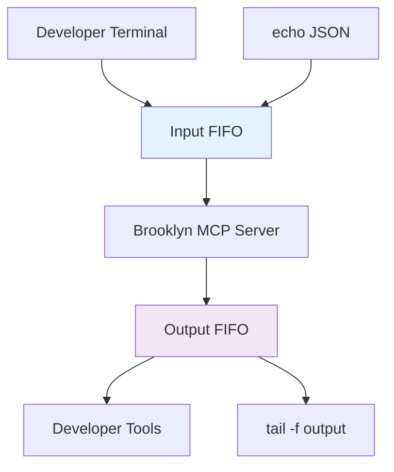
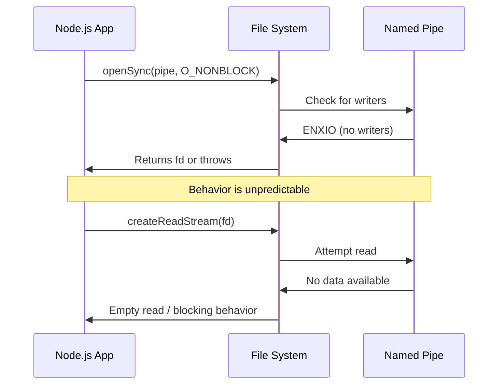

# Node.js FIFO Transport Limitations and Solutions

## Summary

**Date**: 2025-08-16  
**Status**: Implementation Lessons Learned  
**Impact**: Critical for Brooklyn Node.js implementation

## Background

Brooklyn's development mode originally attempted to use named pipes (FIFOs) for inter-process communication between development tools and the MCP server. While FIFOs work excellently in languages like Go and Rust, **Node.js has fundamental limitations that make FIFOs unreliable**.

This technical note documents the specific challenges encountered, provides working examples of failure modes, and presents proven alternative solutions.

## The FIFO Transport Vision

### Intended Architecture



### Expected Developer Experience

```bash
# Start development server
brooklyn mcp dev-start

# Send MCP messages
echo '{"jsonrpc":"2.0","method":"tools/list","id":1}' > /tmp/brooklyn-dev-input

# Read responses
tail -f /tmp/brooklyn-dev-output
```

**This approach works perfectly in Go, but fails consistently in Node.js.**

## Node.js FIFO Limitations

### Core Issue: Event Loop Blocking

Node.js has a **single-threaded event loop** that cannot handle the blocking semantics of FIFO operations:

```typescript
// This will HANG indefinitely in Node.js
const fs = require("fs");
const fd = fs.openSync("/tmp/test.fifo", "w"); // Blocks waiting for reader
```

**Root Cause**: Opening a FIFO for writing blocks until a reader connects. In Node.js's single-threaded model, this blocks the entire process.

### Official Node.js Position

From Node.js core team discussions:

> "We don't support [FIFOs] and probably never will. FIFOs in non-blocking mode have the potential to deadlock the event loop, but you can use UNIX sockets if you need similar functionality."

### Specific Implementation Failures

#### Problem 1: Double openSync Bug

Our initial implementation had a critical bug:

```typescript
// src/transports/mcp-fifo-transport.ts:112-118
try {
  this.inputFd = fs.openSync(inputPipe, fsConstants.O_RDONLY | fsConstants.O_NONBLOCK);
} catch (error) {
  if (err.code === "ENXIO") {
    // BUG: Calling openSync again will hang!
    this.inputFd = fs.openSync(inputPipe, fsConstants.O_RDONLY | fsConstants.O_NONBLOCK);
  }
}
```

**Issue**: The second `openSync` call always hangs because ENXIO is expected behavior for non-blocking FIFO operations.

#### Problem 2: Stream API Incompatibility

```typescript
// This pattern fails with FIFOs
this.readStream = fs.createReadStream("", {
  fd: this.inputFd,
  encoding: "utf8",
  highWaterMark: 16,
  autoClose: false,
});
```

**Issues**:

- `createReadStream` attempts seek operations on FIFOs → `ESPIPE` errors
- Non-blocking reads return empty data when no writers connected
- Race conditions between stream creation and pipe readiness

#### Problem 3: Unpredictable O_NONBLOCK Behavior



### Real-World Failure Modes

#### Test Case 1: Basic FIFO Creation

```bash
# Terminal 1: Create FIFO
mkfifo /tmp/test-pipe

# Terminal 2: Node.js writer
node -e "
const fs = require('fs');
console.log('Opening pipe for write...');
const fd = fs.openSync('/tmp/test-pipe', 'w');
console.log('Opened successfully');
"
# Result: Hangs forever at openSync
```

#### Test Case 2: Non-blocking with Streams

```typescript
// This reproduces our exact failure
const fs = require("fs");
const inputPipe = "/tmp/brooklyn-test-input";

// Step 1: Create FIFO
require("child_process").execSync("mkfifo " + inputPipe);

// Step 2: Open with O_NONBLOCK (this works)
const inputFd = fs.openSync(inputPipe, fs.constants.O_RDONLY | fs.constants.O_NONBLOCK);

// Step 3: Create stream (this fails)
const readStream = fs.createReadStream("", {
  fd: inputFd,
  encoding: "utf8",
  autoClose: false,
});

// Step 4: Try to read
readStream.on("data", data => {
  console.log("Received:", data);
});

// Result: No data ever received, even when written to pipe
```

### Why It Works in Go

Go has different concurrency primitives that handle blocking I/O naturally:

```go
// Go handles this elegantly with goroutines
func openPipe(path string) {
    // This runs in a separate goroutine
    pipe, err := os.OpenFile(path, os.O_RDWR, 0)
    if err != nil {
        log.Printf("Error: %v", err)
        return
    }

    // Non-blocking for the main thread
    go handleReads(pipe)
    go handleWrites(pipe)
}
```

**Key Differences**:

- **Goroutines** provide true concurrency for blocking operations
- **Mature FIFO support** in the standard library
- **Predictable semantics** for non-blocking I/O

## Proven Alternative Solutions

### Solution 1: Unix Domain Sockets (Recommended)

Replace FIFOs with Unix domain sockets for production Brooklyn development:

```typescript
import * as net from "node:net";

export class MCPSocketTransport implements Transport {
  private server?: net.Server;
  private socketPath: string;

  constructor(config: MCPSocketConfig) {
    this.socketPath = config.options.socketPath || "/tmp/brooklyn-mcp.sock";
  }

  async start(): Promise<void> {
    // Clean up any existing socket
    if (fs.existsSync(this.socketPath)) {
      fs.unlinkSync(this.socketPath);
    }

    this.server = net.createServer(socket => {
      this.handleConnection(socket);
    });

    this.server.listen(this.socketPath);

    console.log(`🌉 Brooklyn MCP Socket ready: ${this.socketPath}`);
    console.log(`   Test: echo '{"jsonrpc":"2.0",...}' | nc -U ${this.socketPath}`);
  }

  private handleConnection(socket: net.Socket): void {
    socket.on("data", data => {
      const message = data.toString().trim();
      if (message) {
        this.handleIncomingMessage(message)
          .then(response => {
            socket.write(JSON.stringify(response) + "\n");
          })
          .catch(error => {
            socket.write(
              JSON.stringify({
                jsonrpc: "2.0",
                error: { code: -32603, message: error.message },
              }) + "\n",
            );
          });
      }
    });

    socket.on("error", error => {
      console.error("Socket error:", error);
    });
  }
}
```

**Benefits**:

- ✅ **Reliable** - No blocking issues
- ✅ **Bidirectional** - Full duplex communication
- ✅ **Event-driven** - Fits Node.js model perfectly
- ✅ **Debuggable** - Works with `nc`, `socat`

### Solution 2: TCP with Port Discovery

```typescript
export class MCPTCPTransport implements Transport {
  private server?: net.Server;
  private port: number = 0;

  async start(): Promise<void> {
    this.server = net.createServer(this.handleConnection.bind(this));

    // Let OS assign random port
    this.server.listen(0, "127.0.0.1", () => {
      const address = this.server.address() as net.AddressInfo;
      this.port = address.port;

      // Write port to discovery file
      fs.writeFileSync("/tmp/brooklyn-mcp-port.txt", String(this.port));

      console.log(`🌉 Brooklyn MCP TCP ready: localhost:${this.port}`);
      console.log(`   Test: echo '{"jsonrpc":"2.0",...}' | nc localhost ${this.port}`);
    });
  }
}
```

### Solution 3: File-based Messaging

For environments where sockets are restricted:

```typescript
export class MCPFileTransport implements Transport {
  private inputDir = "/tmp/brooklyn-mcp-input";
  private outputDir = "/tmp/brooklyn-mcp-output";
  private watcher?: chokidar.FSWatcher;

  async start(): Promise<void> {
    fs.mkdirSync(this.inputDir, { recursive: true });
    fs.mkdirSync(this.outputDir, { recursive: true });

    // Watch for new message files
    this.watcher = chokidar.watch(this.inputDir, {
      ignored: /^\./,
      persistent: true,
      ignoreInitial: true,
    });

    this.watcher.on("add", filePath => {
      this.processMessageFile(filePath);
    });

    console.log(`🌉 Brooklyn MCP File transport ready`);
    console.log(`   Send: echo '{"jsonrpc":"2.0",...}' > ${this.inputDir}/msg-$(date +%s).json`);
    console.log(`   Read: tail -f ${this.outputDir}/responses.jsonl`);
  }

  private async processMessageFile(filePath: string): Promise<void> {
    try {
      const content = fs.readFileSync(filePath, "utf8");
      const response = await this.handleIncomingMessage(content);

      // Write response to output directory
      const responseFile = path.join(this.outputDir, "responses.jsonl");
      fs.appendFileSync(responseFile, JSON.stringify(response) + "\n");

      // Clean up input file
      fs.unlinkSync(filePath);
    } catch (error) {
      console.error("Error processing message file:", error);
    }
  }
}
```

## Implementation Recommendations

### For Brooklyn Release

1. **Replace MCPFifoTransport** with MCPSocketTransport immediately
2. **Keep REPL mode** - it works perfectly for interactive testing
3. **Add TCP fallback** for cross-platform compatibility
4. **Update documentation** to reflect socket-based usage

### For Go Implementation

Go can use the original FIFO design effectively:

```go
// This works reliably in Go
func (t *FifoTransport) Start() error {
    // Open input pipe (non-blocking in goroutine)
    go func() {
        inputPipe, err := os.OpenFile(t.inputPath, os.O_RDONLY, 0)
        if err != nil {
            log.Printf("Error opening input pipe: %v", err)
            return
        }
        defer inputPipe.Close()

        scanner := bufio.NewScanner(inputPipe)
        for scanner.Scan() {
            t.handleMessage(scanner.Text())
        }
    }()

    // Open output pipe
    go func() {
        outputPipe, err := os.OpenFile(t.outputPath, os.O_WRONLY, 0)
        if err != nil {
            log.Printf("Error opening output pipe: %v", err)
            return
        }
        defer outputPipe.Close()

        for response := range t.responses {
            fmt.Fprintln(outputPipe, response)
        }
    }()

    return nil
}
```

### Cross-Language Guidelines

| Language    | Recommended Transport | Notes                           |
| ----------- | --------------------- | ------------------------------- |
| **Node.js** | Unix Sockets          | FIFOs don't work reliably       |
| **Go**      | FIFOs or Unix Sockets | Both work well                  |
| **Rust**    | FIFOs or Unix Sockets | Excellent async support         |
| **Python**  | Unix Sockets          | asyncio works well with sockets |
| **Java**    | TCP Sockets           | Best cross-platform support     |

## Testing Strategies

### Automated Transport Testing

```typescript
// Integration test for socket transport
describe("MCPSocketTransport", () => {
  let transport: MCPSocketTransport;
  let client: net.Socket;

  beforeEach(async () => {
    transport = new MCPSocketTransport({
      socketPath: "/tmp/test-brooklyn.sock",
    });
    await transport.start();

    client = new net.Socket();
    await new Promise(resolve => {
      client.connect("/tmp/test-brooklyn.sock", resolve);
    });
  });

  it("should handle MCP initialize request", async () => {
    const request = {
      jsonrpc: "2.0",
      method: "initialize",
      id: 1,
      params: { protocolVersion: "2024-11-05" },
    };

    client.write(JSON.stringify(request) + "\n");

    const response = await new Promise(resolve => {
      client.once("data", data => {
        resolve(JSON.parse(data.toString()));
      });
    });

    expect(response.result.serverInfo.name).toBe("brooklyn-mcp-server");
  });
});
```

### Manual Testing Commands

```bash
# Unix Socket Testing
echo '{"jsonrpc":"2.0","method":"tools/list","id":1}' | nc -U /tmp/brooklyn-mcp.sock

# TCP Socket Testing
echo '{"jsonrpc":"2.0","method":"tools/list","id":1}' | nc localhost 8080

# File Transport Testing
echo '{"jsonrpc":"2.0","method":"tools/list","id":1}' > /tmp/brooklyn-input/test.json
tail -f /tmp/brooklyn-output/responses.jsonl
```

## Lessons Learned

### Technical Insights

1. **Runtime-specific limitations** can invalidate seemingly universal patterns
2. **Event loop architectures** require different IPC approaches than threaded models
3. **Non-blocking I/O** doesn't always mean "async-friendly"
4. **Cross-platform compatibility** often trumps optimal platform-specific solutions

### Development Process Insights

1. **Prototype early** with target runtime environments
2. **Test failure modes** explicitly, not just happy paths
3. **Document limitations** for future language implementations
4. **Plan alternative approaches** before deep implementation

### Architecture Insights

1. **Transport abstraction** enables swapping implementations easily
2. **Protocol consistency** matters more than transport mechanism
3. **Developer experience** drives adoption more than technical elegance
4. **Reference implementations** should showcase best practices, not just functionality

## Migration Path

### Phase 1: Immediate (Pre-Release)

- Replace MCPFifoTransport with MCPSocketTransport
- Update dev mode commands to use socket paths
- Test all existing workflows with socket transport

### Phase 2: Stabilization

- Add TCP transport for cross-platform support
- Implement transport auto-detection/fallback
- Update documentation and examples

### Phase 3: Future

- Consider message queuing for high-volume scenarios
- Implement transport performance monitoring
- Add remote development capabilities

## References

- [Inter-Process Communication Patterns](./patterns.md) - Architectural overview
- [Node.js pipe(7) limitations](https://man7.org/linux/man-pages/man7/pipe.7.html) - System-level documentation
- [Brooklyn MCP Dev Mode](../architecture/notes/mcp-dev-mode-pattern.md) - Implementation context
- [Node.js Issue #23220](https://github.com/nodejs/node/issues/23220) - FIFO limitations discussion

---

**Key Takeaway**: Choose the right tool for the runtime. FIFOs work excellently in Go but should be avoided in Node.js production code.

— Brooklyn Architecture Committee  
Last Updated: August 16, 2025
