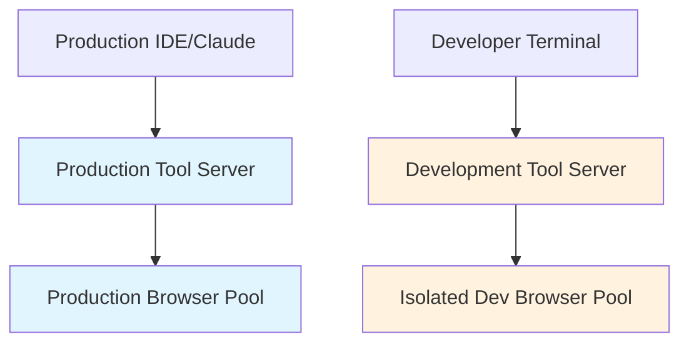
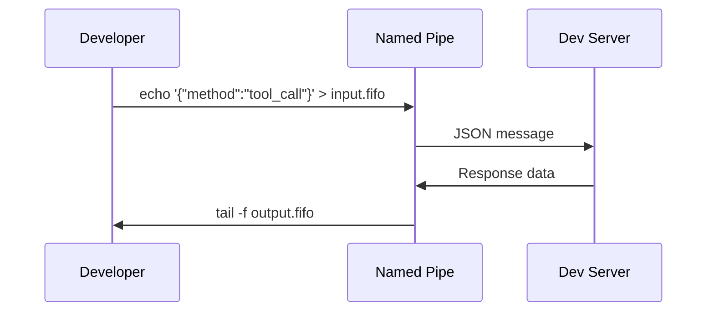
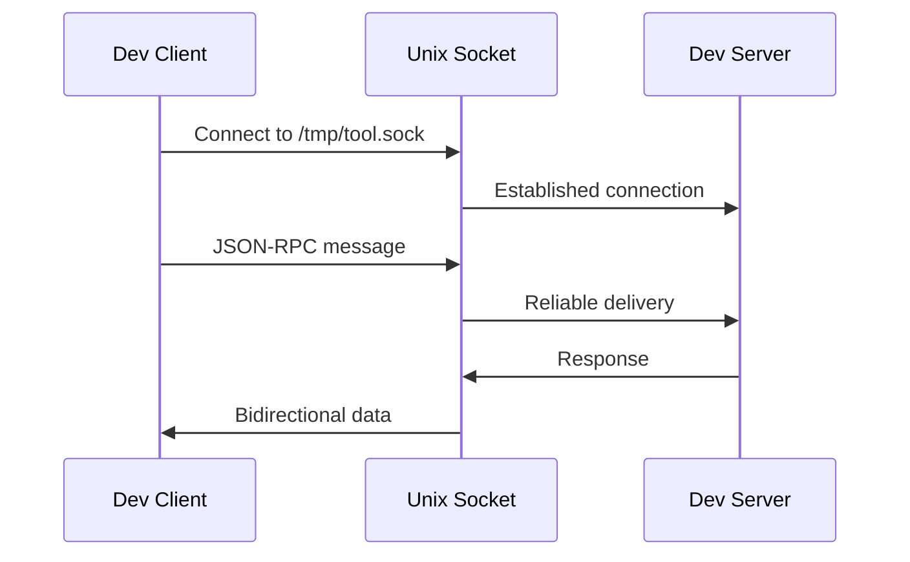
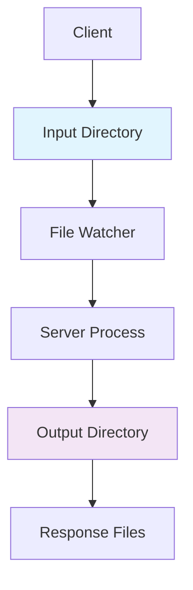
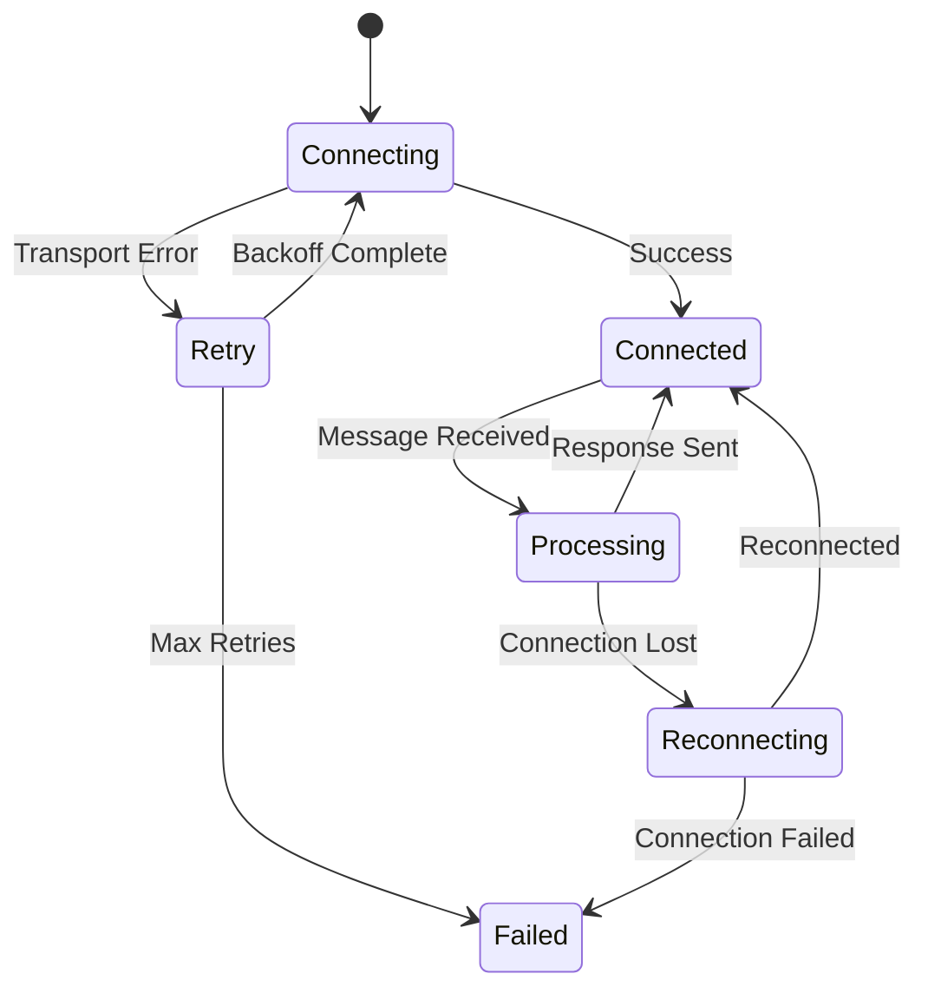

# Inter-Process Communication Patterns for Development Tooling

## Summary

**Date**: 2025-08-16  
**Status**: Reference Implementation  
**Scope**: Cross-language architectural guidance

## Problem Statement

Modern development tooling faces a fundamental challenge: **how to provide rapid iteration cycles without disrupting existing workflows**. When building tools that integrate with IDEs, editors, or AI assistants (like Claude Code), developers need the ability to test and iterate on their tools without restarting the entire development environment.

This is particularly acute for:

- **MCP (Model Context Protocol) servers** that integrate with AI assistants
- **LSP (Language Server Protocol) implementations**
- **Browser automation tools** that manage stateful sessions
- **Any service with expensive startup costs** (database connections, authentication, etc.)

## The Development Mode Pattern

### Core Concept

The **Development Mode Pattern** creates a parallel communication channel that allows developers to test tool functionality without interrupting production integrations.



### Key Principles

1. **Isolation**: Development instances never interfere with production workflows
2. **Protocol Fidelity**: Development mode uses identical protocols (MCP, LSP, etc.)
3. **State Independence**: Separate resource pools (browsers, databases, etc.)
4. **Rapid Iteration**: Code changes don't require restarting production environments

## IPC Transport Patterns

### Pattern 1: Named Pipes (FIFOs)

**Use Case**: Simple, file-system based communication  
**Best For**: Unix-like systems with native FIFO support



**Advantages**:

- Simple filesystem interface
- Natural backpressure handling
- Easy debugging with standard Unix tools
- Cross-language compatibility

**Implementation Considerations**:

- **Blocking behavior** varies by runtime (critical for Node.js)
- **Cleanup requirements** for stale pipes
- **Permission management** for security

### Pattern 2: Unix Domain Sockets

**Use Case**: Bidirectional, reliable communication  
**Best For**: Production-grade development tools



**Advantages**:

- **Bidirectional** communication
- **Connection-oriented** (reliable delivery)
- **Non-blocking** by design
- **Widely supported** across languages

### Pattern 3: TCP Localhost Sockets

**Use Case**: Cross-platform development  
**Best For**: Tools that need Windows compatibility

```mermaid
graph LR
    A[Dev Client] --> B[localhost:random_port]
    B --> C[Dev Server]

    D[Port Discovery] --> E[/tmp/server.port]

    style B fill:#f3e5f5
    style E fill:#e8f5e8
```

**Advantages**:

- **Cross-platform** (Windows, macOS, Linux)
- **Standard networking** libraries
- **Port-based discovery** mechanisms
- **Familiar debugging** tools (netcat, curl)

### Pattern 4: File-Based Queues

**Use Case**: Asynchronous, persistent communication  
**Best For**: Long-running operations or offline processing



**Advantages**:

- **Persistent** message queues
- **Asynchronous** processing
- **Debuggable** file system state
- **Simple** cross-language implementation

## Architecture Decision Framework

### Runtime Considerations

| Pattern       | Node.js      | Go           | Rust         | Python       | Comments                    |
| ------------- | ------------ | ------------ | ------------ | ------------ | --------------------------- |
| Named Pipes   | ⚠️ Limited   | ✅ Excellent | ✅ Good      | ✅ Good      | Node.js has blocking issues |
| Unix Sockets  | ✅ Excellent | ✅ Excellent | ✅ Excellent | ✅ Good      | Best for production         |
| TCP Localhost | ✅ Good      | ✅ Good      | ✅ Good      | ✅ Excellent | Cross-platform winner       |
| File Queues   | ✅ Good      | ✅ Excellent | ✅ Good      | ✅ Good      | Simplest to implement       |

### Selection Criteria

1. **Startup Speed**: How quickly can the communication channel be established?
2. **Runtime Overhead**: What's the performance impact during operation?
3. **Debugging Experience**: How easy is it to inspect and debug messages?
4. **Cross-Platform**: Does it work on target operating systems?
5. **Language Support**: How well does it integrate with the implementation language?

## Implementation Patterns

### Discovery Mechanisms

Development tools need discoverable endpoints:

```bash
# File-based discovery
echo "12345" > /tmp/dev-server.port
echo "/tmp/dev-server.sock" > /tmp/dev-server.socket

# Environment-based discovery
export DEV_SERVER_PORT=12345
export DEV_SERVER_SOCKET=/tmp/dev.sock

# PID-based discovery
echo '{"pid":12345,"port":8080,"socket":"/tmp/dev.sock"}' > /tmp/dev-info.json
```

### Message Framing

Different transports require different framing strategies:

```javascript
// Line-delimited JSON (for pipes and sockets)
{"jsonrpc":"2.0","method":"test","id":1}

// Length-prefixed (for binary protocols)
0000001E{"jsonrpc":"2.0","method":"test","id":1}

// File-per-message (for file queues)
/tmp/queue/msg-1692198432-001.json
```

### Error Handling Patterns



## Cross-Language Implementation Notes

### Go Implementation Advantages

```go
// Go excels at named pipes
pipe, err := os.OpenFile("/tmp/dev.fifo", os.O_RDWR, 0600)
if err != nil {
    return fmt.Errorf("failed to open pipe: %w", err)
}

// Native goroutine support for concurrent I/O
go handleInput(pipe)
go handleOutput(pipe)
```

### Node.js Implementation Considerations

```typescript
// Unix sockets work well in Node.js
const server = net.createServer(socket => {
  socket.on("data", handleMessage);
});
server.listen("/tmp/dev.sock");

// Named pipes have limitations (see technical note)
```

### Universal Patterns

1. **JSON-RPC** for protocol consistency
2. **Signal handling** for graceful shutdown
3. **PID files** for process management
4. **Cleanup routines** for resource management

## Future Evolution

### Potential Extensions

1. **Multi-instance coordination** - Multiple dev servers per project
2. **Remote development** - Network-accessible dev servers
3. **Protocol bridges** - Converting between transport types
4. **Performance monitoring** - Built-in latency and throughput metrics

### Ecosystem Integration

This pattern could evolve into a standard for development tooling:

- **Language servers** with dev mode for LSP testing
- **Database tools** with isolated dev instances
- **API servers** with parallel dev endpoints
- **Testing frameworks** with isolated test runners

## References

- [Brooklyn MCP Dev Mode Pattern](../architecture/notes/mcp-dev-mode-pattern.md) - Specific implementation
- [Node.js FIFO Transport Limitations](./nodejs-fifo-transport-limitations.md) - Runtime-specific challenges
- [MCP Protocol Specification](https://modelcontextprotocol.io/docs) - Protocol details
- [Unix IPC Mechanisms](https://man7.org/linux/man-pages/man7/pipe.7.html) - System-level documentation

---

**Next**: See [Node.js FIFO Transport Limitations](./nodejs-fifo-transport-limitations.md) for implementation-specific challenges and solutions.

— Brooklyn Architecture Committee  
Last Updated: August 16, 2025
